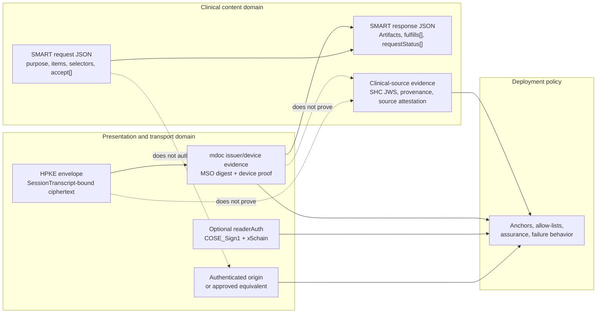
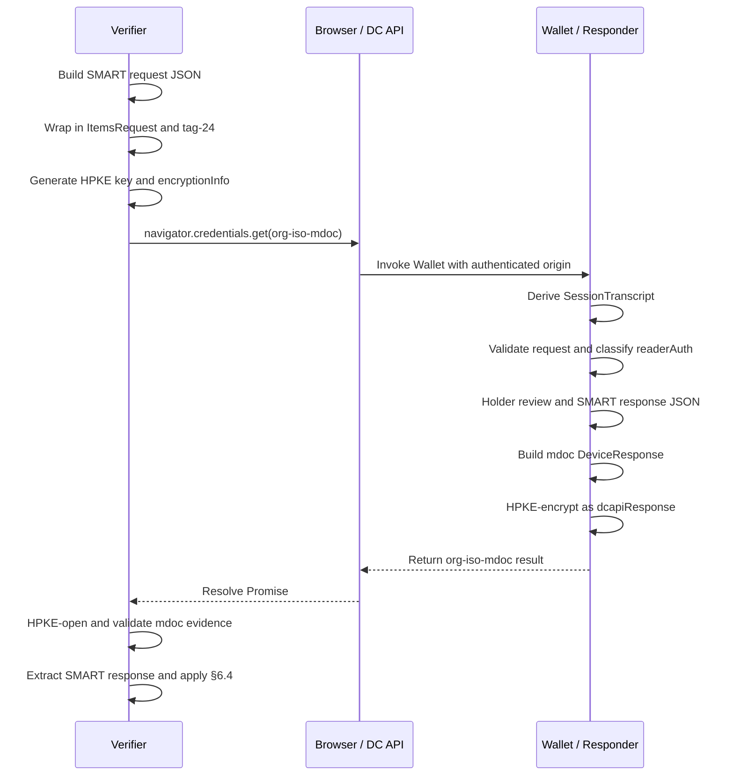

# SMART Health Check-in 1.0

A transport-neutral clinical request and response model for patient-mediated check-in, with a version 1.0 same-device presentation flow using direct `org-iso-mdoc` over the W3C Digital Credentials API.

Short title: **SMART Health Check-in 1.0**. Suggested citation label: **SHC-Checkin-1.0**. Suggested document identifier: `smart-health-checkin-1.0`.

---

## 0. Front Matter

Status: editor's draft for implementer review. Version: 1.0 draft. Publication metadata, editors, contributors, IPR statements, and final governance metadata are to be supplied by the publishing organization. Example identifiers, URLs, names, keys, and clinical data are illustrative unless explicitly identified as fixed protocol values.

**Editorial approach:** This candidate uses a docs-as-code style: brief narrative, TypeScript interfaces with normative JSDoc for the clinical data model, Mermaid diagrams for flow orientation, stable section numbers, and minimal examples. The main file preserves normative request/response rules, trust rules, same-device wire details, CDDL, registries, and the conformance checklist. Tutorials, fixture indexes, byte ladders, JSON Schema artifacts, implementation notes, FHIR mapping walkthroughs, and historical material are treated as companion material; normative implementation rules remain here.

Copyright and license terms are to be finalized before publication. The text is intended for CC BY 4.0 or a successor open documentation license; TypeScript interfaces, CDDL, pseudocode, and test scaffolding are intended for implementation and conformance testing under final package terms.

---

## 1. Introduction

SMART Health Check-in 1.0 defines a patient-mediated check-in profile in which a **Requester** asks a **Holder**, through a **Wallet/Responder**, to share workflow-bounded clinical or administrative content and receives a structured **SMART response**. Version 1.0 has two normative layers: the transport-neutral clinical JSON request/response model in §§5-6, and same-device direct `org-iso-mdoc` presentation over the W3C Digital Credentials API in §§7-8. In-person QR, NFC, deep-link, pointer, relay, submission, and completion mechanisms are deployment-defined ways to land a Holder on a same-device Verifier page; they are not separate protocol layers.

### 1.1 Core Trust Rule

SMART request and SMART response JSON are clinical content objects, not trust credentials. A component SHALL NOT treat `purpose`, item text, selector values, unknown request members, deployment handoff metadata, launch URLs, demo labels, Artifact ids, `fulfills[]`, `requestId`, successful HPKE opening, mdoc issuer/device evidence, optional `readerAuth`, Holder action, or syntactic response validity as a substitute for any other trust layer unless this specification or an explicit deployment profile defines that relationship and assurance level. Origin trust, reader/Verifier trust, issuer/device evidence, clinical-source provenance, Holder control, presentation freshness, patient matching, downstream authorization, and local clinical acceptance are separate decisions.

### 1.2 Architecture summary

| Layer or role | Standardized here | Deployment policy or companion material |
| --- | --- | --- |
| Clinical request (§5) | `SmartHealthCheckinRequest`, items, display fields, `selection.fhir`, `form.fhir`, `accept[]`, canonical handling. | Workflow rationale, local UI copy, stricter profile limits. |
| Clinical response (§6) | `SmartHealthCheckinResponse`, Artifacts, media types, `fulfills[]`, status codes, many-to-many fulfillment, cross-validation. | Downstream ingestion, reconciliation, deduplication, retention, clinical sufficiency. |
| Trust (§7) | Separation of origin, reader, issuer/device, clinical-source, identifier, and deployment-policy layers. | Trust anchors, registries, allow-lists, assurance labels, patient matching, failure policy. |
| Same-device flow (§8) | Direct `org-iso-mdoc`, `docType`, namespace, stable element, request carrier, `SessionTranscript`, HPKE, mdoc validation, extraction. | Browser/wallet UX, production issuer onboarding, platform APIs, optional stricter constraints. |
| Handoff UX | QR, NFC, deep links, signs, kiosks, or relays MAY load a same-device Verifier page. | URL shape, relay/storage, completion, staff workflow, pairing; not conformance features. |

The profile uses FHIR-native selectors where they fit: exact profile canonicals in `profiles[]`, profile-family canonicals in `profilesFrom[]`, official FHIR `resourceType` names in `resourceTypes[]`, and FHIR Questionnaire selection through `form.fhir`. `profilesFrom[]` is an array of canonical profile-family URLs. `profiles[]` and `profilesFrom[]` are additive selectors, not narrowing selectors.

### 1.3 Scope, non-goals, and conventions

The profile standardizes request and response semantics for interoperable check-in. It does not define credential issuance, Holder data-source synchronization, longitudinal Wallet storage, EHR write-back, patient matching, identity proofing, proxy authority, payment adjudication, claims submission, general FHIR query, SMART App Launch replacement, universal wallet portability, or cross-device relay standardization. Products may implement those functions around this protocol, but they SHALL NOT change SMART request semantics, SMART response semantics, §7 trust-layer separation, or §8 same-device validation.

The key words **MUST**, **MUST NOT**, **REQUIRED**, **SHALL**, **SHALL NOT**, **SHOULD**, **SHOULD NOT**, **RECOMMENDED**, **NOT RECOMMENDED**, **MAY**, and **OPTIONAL** are interpreted as described in BCP 14, RFC 2119, and RFC 8174 when all capitals. JSON uses RFC 8259; CBOR uses RFC 8949; CDDL uses RFC 8610; COSE uses RFC 9052/9053; HPKE uses RFC 9180. Base64url fields use base64url without padding unless stated otherwise. Cryptographic operations use exact bytes named by the relevant section.

Key terms: **Artifact** is a response object with `id`, `mediaType`, `fulfills[]`, and media-type-defined payload fields. **Requester** constructs the SMART request and consumes the SMART response. **Verifier** invokes, opens, validates, and extracts from a presentation flow. **Holder** controls disclosure. **Wallet/Responder** reviews requests and returns responses. **SMART request** and **SMART response** are the JSON objects in §§5-6. **Same-device presentation flow** is the §8 direct `org-iso-mdoc` flow. **In-person handoff** is deployment UX that loads a same-device Verifier page, not a v1.0 wire format.

### 1.4 Companion material

Non-normative tutorials, fixture indexes, byte ladders, diagrams, platform implementation notes, historical captures, reference code, demo applications, and detailed FHIR mapping walkthroughs should live as companion material outside the normative specification. That companion material MAY live in the same repository as this specification, in linked documentation, in a publication package, or in another maintained location. Companion material SHALL NOT redefine core fields, identifiers, algorithms, validation rules, selector semantics, status semantics, or trust boundaries. Fixture authors SHOULD classify companion fixtures and label demo keys, self-signed material, deterministic randomness, synthetic data, and non-production trust anchors.

### 1.5 Normative TypeScript data model

TypeScript interfaces and their accompanying JSDoc comments in this specification define the normative data model and field-level constraints. They are intended to be directly imported into implementer codebases. The TypeScript syntax expresses object shape, required versus optional members, literal discriminators, and discriminated unions; JSDoc comments carry the normative `SHALL`, `SHALL NOT`, `SHOULD`, `MAY`, and processing requirements that TypeScript alone cannot enforce, such as non-empty strings, array uniqueness, exact string comparison, selector additivity, and trust separation.

---

## 4. Conformance

A conformance claim SHALL identify target(s), feature set/profile, specification version, and any deployment profile that changes policy choices left open by this specification. One product MAY implement multiple targets, but it SHALL satisfy every requirement for each claimed target and feature.

SMART Health Check-in 1.0 has two normative layers: (1) transport-neutral clinical request/response in §§5-6, and (2) direct same-device `org-iso-mdoc` presentation, including trust processing, in §§7-8. A deployment MAY use QR, NFC, deep links, desktop signs, kiosk screens, or other handoffs to land the Holder on a §8 page. That handoff is implementation-defined UX, not a conformance feature or wire protocol.

| Target | Required behavior |
| --- | --- |
| Requester | Constructs §5 requests and asks only for Artifact media types it can parse, validate, and route. It SHALL keep clinical request fields distinct from trust evidence and SHALL NOT put requester identity, organization metadata, origin, reader credentials, callbacks, handoff metadata, or trust claims in the request body. |
| Verifier | Packages a SMART request, validates returned presentation artifacts, extracts the SMART response, and applies §6.4 against the original request before use. Direct `org-iso-mdoc` claims SHALL satisfy §8 Verifier obligations. |
| Holder Wallet / Responder | Validates §5 requests, applies Holder control and Wallet policy at item granularity, preserves item ids, constructs §6 responses, and sets `requestId` to request `id`. Direct `org-iso-mdoc` claims SHALL satisfy §8 Wallet obligations. |
| Deployment/profile author | SHALL state constrained targets, required optional features, trust layers, and added validation/security/privacy/fixture expectations. SHALL NOT redefine core clinical semantics, same-device carriers, trust-layer separation, or handoff UX. |
| Conformance/fixture author | SHALL derive tests and fixtures from normative requirements and identify target, feature set, section, expected outcome, comparison mode, and demo trust status. |

Core clinical support includes fixed request/response `type` and `version`; request ids; item ids; display fields; `selection.fhir`; `form.fhir` with `questionnaireCanonical` and/or `questionnaire`; `profilesFrom[]` as an array; additive `profiles[]` plus `profilesFrom[]`; canonical `|version` handling; per-item `accept[]`; Artifact `mediaType`; no `GenericArtifact` or generic Artifact catch-all; `application/fhir+json` with `fhirVersion`; `application/smart-health-card` with `value.verifiableCredential[]` and no outer `fhirVersion`; exact `requestStatus[]` coverage; and §6.4 cross-validation.

Optional features include reader authentication, registered selector kinds, registered Artifact media types, compatibility rules, future status-code extensions, stricter deployment validation profiles, fixture profiles, and future bindings. An implementation claiming an optional feature SHALL implement its construction, processing, validation, unsupported behavior, security, privacy, and conformance rules. `readerAuth` is optional unless a deployment profile requires it; if present, Verifier SHALL construct it as §8 defines, and Wallet/Responder that supports or relies on it SHALL verify and classify it under §§7-8 and policy. Demo keys/certs and fixture trust material MAY be used only when clearly labeled and SHALL NOT be represented as production trust anchors unless explicit policy accepts them.

| Kind | Value |
| --- | --- |
| Request discriminator | `smart-health-checkin-request` |
| Response discriminator | `smart-health-checkin-response` |
| Request/response model version | `1` |
| Core selector kinds | `selection.fhir`, `form.fhir` |
| Core Artifact media types | `application/fhir+json`, `application/smart-health-card` |
| Core status codes | `fulfilled`, `partial`, `unavailable`, `declined`, `unsupported`, `error` |
| DC API protocol id | `org-iso-mdoc` |
| mdoc `docType` | `org.smarthealthit.checkin.1` |
| mdoc namespace | `org.smarthealthit.checkin` |
| mdoc stable response element | `smart_health_checkin_response` |
| SMART request carrier key | `org.smarthealthit.checkin.request` |

Provisional labels are `smart-health-checkin-core-1`, `smart-health-checkin-mdoc-dcapi-1`, `smart-health-checkin-readerauth-1`, `smart-health-checkin-fixtures-1`, and reserved `smart-health-checkin-oid4vp-reserved`. Profile labels SHALL NOT be placed inside a SMART request to bypass selectors, `accept[]`, validation, or trust processing. Implementations SHALL compare and interpret the version marker for the layer being processed and SHALL NOT substitute one layer's version for another. Extensions SHALL be explicit and additive and SHALL NOT redefine core fields, selector kinds, Artifact rules, status codes, same-device carriers, or §7 trust-layer separation. Appendix A indexes testable obligations and SHALL NOT create independent obligations.

---

## 5. Clinical Request Model

A SMART request is the transport-neutral clinical JSON object by which a Requester asks a Holder, through a Wallet/Responder, to share workflow-bounded content. Presentation transports may add origin, reader authentication, signatures, encryption, freshness, device evidence, routing identifiers, and validation artifacts; they do not change `purpose`, items, selectors, `accept[]`, item ids, or `required`.

### 5.1 Encoding rules

A SMART request SHALL be an RFC 8259 JSON object and, when serialized by a transport, SHALL be UTF-8. A Requester SHALL NOT include comments, trailing commas, duplicate object member names, `NaN`, `Infinity`, `-Infinity`, or non-JSON values. A Wallet/Responder or Verifier parsing a request SHALL reject a non-object top-level value or unparsable representation.

JSON member names SHALL be unique; duplicate names detected during parsing or validation SHALL cause rejection. Object member order has no clinical meaning. `fhirVersions[]` and `accept[]` are preference-ordered; `items[]` is preferred display/workflow order. The model defines no numeric fields; identifiers, versions, booleans, arrays, media types, FHIR canonicals, and display strings SHALL NOT be encoded as numbers. A Requester SHOULD keep values no larger than needed. Wallet/Responder MAY reject requests exceeding implementation, transport, safety, display, or policy limits.

A Wallet/Responder MAY ignore unknown members when they do not change known required-member meaning. A Requester SHALL NOT rely on unknown members to carry requester identity, override Holder control, change `accept[]`, selector semantics, `required`, or transport/trust/consent behavior. Unknown `content.kind` values identify extension selector kinds and are not ignorable.

### 5.2 Normative TypeScript model

```typescript
export type NonEmptyString = string;
export type NonEmptyArray<T> = [T, ...T[]];
export type FhirCanonical = NonEmptyString;
export type FhirCanonicalUrl = NonEmptyString;
export type FhirRelease = NonEmptyString;
export type FhirResourceType = NonEmptyString;
export type MediaTypeString = NonEmptyString;

export interface SmartHealthCheckinRequest {
  /**
   * Request discriminator.
   * Requester SHALL set exactly "smart-health-checkin-request".
   * Wallet/Responder SHALL reject absent or different values.
   */
  type: "smart-health-checkin-request";

  /**
   * SMART request model version.
   * Requester SHALL set exactly "1".
   * Wallet/Responder SHALL reject absent or different values unless a future
   * compatibility rule applies.
   */
  version: "1";

  /**
   * Opaque Requester-generated request id.
   * SHALL be non-empty and unique among that Requester's requests for the same
   * check-in session. SHOULD resist accidental collision and cross-session
   * guessing. Wallet/Responder SHALL preserve it exactly as response
   * `requestId`. It is not patient identity, requester identity, freshness,
   * authorization, or a clinical fact.
   */
  id: NonEmptyString;

  /**
   * Optional Holder-facing workflow context.
   * SHALL NOT carry requester identity, organization, origin, logo/contact URL,
   * legal attestation, authority proof, consent language, trust status, or
   * persistent authorization. Wallet/Responder MAY display it but SHALL NOT
   * treat it as identity or trust.
   */
  purpose?: string;

  /**
   * Ordered FHIR release-version preferences, most preferred first.
   * Requester accepting `application/fhir+json` SHOULD include at least one
   * unless it can process any conforming version. Wallet/Responder SHOULD use
   * this list when choosing raw FHIR JSON versions, subject to Holder choice,
   * data, capability, policy, and `accept[]`.
   */
  fhirVersions?: FhirRelease[];

  /**
   * Request items in preferred display/workflow order.
   * Requester SHALL include an array and SHOULD include at least one item.
   * Wallet/Responder SHALL process items as Holder-review and
   * response-accounting granularity and MAY group, summarize, or reorder
   * display while preserving item ids.
   */
  items: SmartHealthCheckinRequestItem[];

  /**
   * Unknown members MAY be ignored only when they do not alter known semantics.
   * They SHALL NOT be used for requester identity, Holder-control override,
   * selector changes, media negotiation, consent, transport, or trust.
   */
  [extensionMember: string]: unknown;
}

export interface SmartHealthCheckinRequestItem {
  /**
   * Item id scoped to one request.
   * SHALL be a non-empty string unique within the request. Wallet/Responder and
   * Verifier SHALL compare by exact string equality and SHALL reject missing,
   * non-string, empty, or duplicate ids. Requester SHOULD avoid patient ids,
   * requester ids, secrets, tracking values, and clinical facts.
   */
  id: NonEmptyString;

  /**
   * Non-empty Holder-facing display title.
   * SHALL NOT substitute for authenticated requester identity.
   */
  title: NonEmptyString;

  /**
   * Optional Holder-facing explanation.
   * SHOULD clarify broad selectors, profile-family requests, or questionnaire
   * purpose. SHALL NOT substitute for authenticated requester identity.
   */
  summary?: string;

  /**
   * Advisory workflow context. Omitted means false.
   * SHALL NOT be treated as consent, authorization, a Wallet command, or a
   * fulfillment guarantee. Wallet/Responder SHALL NOT use `required: true` to
   * bypass Holder control, Wallet policy, law, or consent UX, and MAY return
   * declined, unavailable, unsupported, partial, or error for required items.
   */
  required?: boolean;

  /**
   * Selector object with a string `kind` discriminator.
   * Version 1.0 defines `selection.fhir` and `form.fhir`. Wallet/Responder
   * SHALL NOT infer unsupported selector semantics from display text or
   * unrelated fields; it SHALL reject the request or report `unsupported`.
   */
  content: Selector;

  /**
   * Accepted Artifact media types, most preferred first.
   * SHALL be a non-empty ordered array. Requester SHALL list only media types it
   * can parse, validate, and route. Wallet/Responder SHALL NOT return an
   * Artifact for this item unless its `mediaType` appears here, except under a
   * supported registered compatibility rule.
   */
  accept: NonEmptyArray<MediaTypeString>;

  [extensionMember: string]: unknown;
}

export type Selector =
  | SelectionFhirSelector
  | FormFhirSelector
  | ExtensionSelector;

export interface SelectionFhirSelector {
  /**
   * SHALL be exactly "selection.fhir".
   * This selector requests existing patient-specific FHIR resources.
   */
  kind: "selection.fhir";

  /**
   * Exact FHIR StructureDefinition canonical URLs.
   * Values MAY include `|version`. Wallet/Responder MAY match by `meta.profile`
   * or equivalent local/trusted conformance evidence; full profile validation
   * during matching is not required.
   */
  profiles?: NonEmptyArray<FhirCanonical>;

  /**
   * Canonical profile-family URL strings.
   * SHALL be a non-empty array when present. SHALL NOT be encoded as a string,
   * object, package descriptor, implementation-guide object, package id/version,
   * npm package name, registry alias, local topic vocabulary, or URN unless a
   * future version or extension defines that value space.
   */
  profilesFrom?: NonEmptyArray<FhirCanonicalUrl>;

  /**
   * Official FHIR resourceType names only.
   * SHALL NOT use local topic labels. With profile selectors this is an
   * additional constraint; without profile selectors it requests
   * patient-specific resources of the listed types.
   */
  resourceTypes?: NonEmptyArray<FhirResourceType>;

  /** SHALL NOT be present; use a separate `form.fhir` item for form completion. */
  questionnaireCanonical?: never;

  /** SHALL NOT be present; use a separate `form.fhir` item for form completion. */
  questionnaire?: never;

  [extensionMember: string]: unknown;
}

export interface FhirQuestionnaire {
  /** SHALL be exactly "Questionnaire". */
  resourceType: "Questionnaire";

  /** Optional FHIR canonical URL used when comparing to `questionnaireCanonical`. */
  url?: string;

  /** Optional FHIR version used when comparing to versioned canonicals. */
  version?: string;

  [fhirMember: string]: unknown;
}

interface FormFhirSelectorBase {
  /** SHALL be exactly "form.fhir". */
  kind: "form.fhir";

  /** SHALL NOT be present on `form.fhir`; use a separate `selection.fhir` item. */
  profiles?: never;

  /** SHALL NOT be present on `form.fhir`; use a separate `selection.fhir` item. */
  profilesFrom?: never;

  /** SHALL NOT be present on `form.fhir`; use a separate `selection.fhir` item. */
  resourceTypes?: never;

  [extensionMember: string]: unknown;
}

export interface FormFhirSelectorWithCanonical extends FormFhirSelectorBase {
  /**
   * Requester's explicit Questionnaire identity.
   * SHALL be non-empty when present and MAY include `|version`. Wallet/Responder
   * SHALL preserve it for canonical-version handling and generated
   * `QuestionnaireResponse.questionnaire` when known.
   */
  questionnaireCanonical: FhirCanonical;

  /**
   * Optional inline FHIR Questionnaire body to render or use.
   * If both fields are present, Requester SHOULD keep this resource's `url` and
   * `version` consistent with `questionnaireCanonical`.
   */
  questionnaire?: FhirQuestionnaire;
}

export interface FormFhirSelectorWithQuestionnaire extends FormFhirSelectorBase {
  /** Optional explicit Questionnaire identity; see `FormFhirSelectorWithCanonical`. */
  questionnaireCanonical?: FhirCanonical;

  /**
   * Inline FHIR Questionnaire body to render or use.
   * SHALL be a FHIR Questionnaire resource object with `resourceType`
   * "Questionnaire".
   */
  questionnaire: FhirQuestionnaire;
}

export type FormFhirSelector =
  | FormFhirSelectorWithCanonical
  | FormFhirSelectorWithQuestionnaire;

export interface ExtensionSelector {
  /**
   * Registered extension selector kind.
   * SHALL be a non-empty string other than "selection.fhir" or "form.fhir" and
   * SHALL be defined by an extension registration before interoperable use.
   */
  kind: string;

  [extensionMember: string]: unknown;
}
```

A Requester SHALL NOT include self-asserted requester identity metadata in the SMART request body, including organization/facility names, logos/branding, URLs/callbacks/domains/origins/package names/app ids/certificates, signed-request/reader/Verifier/trust-framework/issuer/accreditation/legal-entity metadata, or pointer/relay/completion/encryption/nonce/handoff/wrapper metadata. Wallet/Responder SHALL NOT treat any request body field as authenticated requester identity unless established outside the body by presentation flow, trust processing, or policy.

### 5.3 Request item constraints

The TypeScript model in §5.2 defines request item fields, cardinality, and field-level constraints. Each request item is one unit of requested content or action and one unit of Holder review and response accounting. Requester SHALL include `id`, `title`, `content`, and non-empty `accept[]` on every item and MAY include `summary` and `required`.

### 5.4 Content selectors

Selectors describe acceptable clinical content or action. They are not a general FHIR query language, authorization policy, patient-matching rule, requester identity channel, or clinical decision support expression. A Requester SHALL use a selector defined here or a registered extension. A Wallet/Responder SHALL evaluate selector semantics independently per item while allowing §6 many-to-many Artifact fulfillment.

#### 5.4.1 `selection.fhir`

For `selection.fhir`, if both `profiles[]` and `profilesFrom[]` are present, Wallet/Responder SHALL treat them as additive profile selectors: a resource matches if it matches any exact profile or any profile in any requested family, subject to `resourceTypes[]` and the rest of the item. Requester SHALL NOT rely on `profiles[]` to narrow `profilesFrom[]`; Wallet/Responder SHALL NOT interpret it that way.

If all `selection.fhir` selector arrays are omitted, the item requests any patient-specific FHIR resources the Wallet/Responder can offer and the Holder chooses to share, constrained by `accept[]`, `fhirVersions[]` where applicable, capability, policy, and Holder decision. Requester SHOULD avoid this no-selector default unless broad content is safe and clearly explained. Wallet/Responder MAY fulfill it partially and is not required to disclose all resources.

#### 5.4.2 `form.fhir`

For `form.fhir`, a Wallet/Responder SHALL reject or report `unsupported` when neither form field is present, `questionnaireCanonical` is non-string or blank, `questionnaire` is not a Questionnaire, or `selection.fhir` fields are mixed in. Wallet/Responder MAY resolve `questionnaireCanonical` using configured resolvers, FHIR search, cache, Holder data source, or local mechanisms satisfying §5.4. Direct HTTP dereference is permitted only for unversioned canonicals. If it cannot resolve, render, or use the Questionnaire, it SHALL report an outcome under §6 rather than fabricating one. When both form fields are supplied, `questionnaireCanonical` is the Requester's explicit Questionnaire identity and the inline resource is the body to render or use. Wallet/Responder SHALL NOT silently merge conflicting definitions or silently rewrite the Requester's canonical. If it detects material disagreement, it SHOULD report `unsupported` or `error` rather than collecting ambiguous answers.

#### 5.4.3 Extension selectors

An extension registrant SHALL define exact kind string, TypeScript/JSON shape, members, clinical meaning, content-satisfaction rules, interaction with `accept[]`, `fhirVersions[]`, canonicals, status and fulfillment, unsupported/unavailable/partial/error behavior, unknown-member handling, security and privacy considerations, and at least one example. It SHALL NOT redefine core fields, core selector kinds, Holder control, requester identity handling, canonical-version handling, or trust boundaries. Requester SHALL NOT use unregistered or private extension selectors when interoperable processing by unrelated Wallets/Responders is expected. Wallet/Responder that does not support an extension selector SHALL NOT guess semantics; it SHALL reject or report `unsupported`.

### 5.5 Canonical `|version` handling

A Requester MAY include `|version` where this section permits FHIR canonicals and SHOULD NOT include it in `profilesFrom[]` unless identifying a versioned profile family. Any processor of a FHIR canonical SHALL parse it into non-empty `url` and optional `version`: `url` is before the first `|`, or the entire string if absent; `version` is after the first `|`, with further `|` characters part of the opaque version. Implementations SHALL preserve the original wire string exactly for echoing, logging, response construction, fixtures, returned `Resource.meta.profile`, and generated `QuestionnaireResponse.questionnaire` when that canonical is the answered Questionnaire identity.

A Wallet/Responder or Verifier resolving a canonical SHALL use a configured resolver, package cache, terminology service, IG resolver, or FHIR search when available. FHIR search uses `GET [base]/{ResourceType}?url={url}&version={version}` for versioned canonicals and `GET [base]/{ResourceType}?url={url}` for unversioned. Direct HTTP dereference is permitted only for unversioned canonicals and only if returned resources pass verification. An implementation SHALL NOT satisfy a versioned canonical by stripping `|version` and directly dereferencing the bare URL.

After resolution, the implementation SHALL verify expected `resourceType`, `url` equal to parsed request `url`, and, for versioned requests, `version` equal to parsed request `version`; failure SHALL produce `unsupported` or `error` under §6. For versioned `profiles[]`, Wallet/Responder SHALL NOT report `fulfilled` unless returned `meta.profile` includes the same versioned canonical or equivalent exact-version evidence exists; Verifier SHALL apply the same exact-version rule. For unversioned `profiles[]`, matching any supported version of the base canonical is allowed subject to evidence and validation. Routing, grouping, profile-family lookup, and display MAY ignore `|version` only locally; they SHALL NOT rewrite exact-version evidence, response fields, diagnostics, or validation inputs.

### 5.6 Accepted media types

Requester SHALL include non-empty ordered `accept[]` on every item, encode each value as a media type string, order from most to least preferred, and list only media types it can parse, validate, and route. Wallet/Responder MAY return any listed type and SHOULD choose the earliest equivalent producible type. Wallet/Responder and Verifier SHALL enforce that every Artifact `mediaType` is accepted by every fulfilled item, except under a supported registered compatibility rule.

Core media types are `application/fhir+json` for raw FHIR JSON Resource or Bundle and `application/smart-health-card` for SMART Health Card file JSON. For `form.fhir` items, `application/fhir+json` normally carries a FHIR `QuestionnaireResponse`. Extension media types MAY be used when registered or agreed by deployment. Registrants SHALL define media type string, Artifact shape, processing, validation, security, privacy, FHIR-version handling if any, and compatibility with core media types if any.

---

## 6. Clinical Response Model

A SMART response is the transport-neutral JSON object by which a Wallet/Responder answers after Holder review, Wallet policy, and data-source availability. Transports may wrap, encrypt, authenticate, retain, or relay it, but do not change `requestId`, `artifacts[]`, `mediaType`, `fulfills[]`, or `requestStatus[]`.

### 6.1 Normative TypeScript model

```typescript
export interface SmartHealthCheckinResponse {
  /**
   * Response discriminator.
   * Wallet/Responder SHALL set exactly "smart-health-checkin-response".
   * Verifier SHALL reject absent or different values.
   */
  type: "smart-health-checkin-response";

  /**
   * SMART response model version.
   * Wallet/Responder SHALL set exactly "1". Verifier SHALL reject absent or
   * different values unless a future compatibility rule applies.
   */
  version: "1";

  /**
   * Correlates this response to the accepted request.
   * Wallet/Responder SHALL set exactly to `SmartHealthCheckinRequest.id`.
   * Verifier SHALL compare by exact string equality and reject mismatch. It is
   * not identity, freshness, presentation session id, authorization, or a
   * clinical fact.
   */
  requestId: NonEmptyString;

  /**
   * Returned clinical Artifacts.
   * MAY be empty when no item returns content, if `requestStatus[]` accounts for
   * every original request item. Each Artifact SHALL follow the common and
   * media-type-specific rules below.
   */
  artifacts: Artifact[];

  /**
   * Per-item outcomes.
   * SHALL include exactly one entry for every original request item and no
   * duplicate or unknown item ids, even when every item is fulfilled.
   */
  requestStatus: RequestItemStatus[];

  [extensionMember: string]: unknown;
}

export type Artifact =
  | SmartHealthCardArtifact
  | RawFhirJsonArtifact
  | ExtensionArtifact;

interface ArtifactBase {
  /**
   * Artifact id scoped to one response.
   * SHALL be non-empty and unique within the response. Verifier SHALL reject
   * missing, non-string, empty, or duplicate ids. It is not a patient id,
   * requester id, global document id, or provenance id unless independent
   * payload evidence or policy gives it that meaning.
   */
  id: NonEmptyString;

  /**
   * Clinical response form.
   * SHALL be a non-empty media type string. Artifacts do not use a separate
   * protocol `type`. Verifier SHALL NOT treat unrecognized media types as
   * `GenericArtifact` or any other generic catch-all.
   */
  mediaType: MediaTypeString;

  /**
   * Original request item ids this Artifact fulfills.
   * SHALL be a non-empty array. Each value SHALL exactly equal one original
   * request item id. If one Artifact fulfills multiple items, its `mediaType`
   * SHALL be accepted by every fulfilled item.
   */
  fulfills: NonEmptyArray<NonEmptyString>;
}

export interface SmartHealthCardArtifact extends ArtifactBase {
  /** SHALL be exactly "application/smart-health-card". */
  mediaType: "application/smart-health-card";

  /**
   * SMART Health Card file payload.
   * SHALL contain a non-empty `verifiableCredential[]` array of SMART Health
   * Card Verifiable Credential JWS strings. Verifier/receiver SHALL verify and
   * process each JWS according to SMART Health Cards and local trust policy.
   */
  value: {
    verifiableCredential: NonEmptyArray<NonEmptyString>;
    [payloadMember: string]: unknown;
  };

  /**
   * SHALL NOT be present on SMART Health Card Artifacts.
   * FHIR version and issuer semantics are inside signed payloads.
   */
  fhirVersion?: never;
}

export interface FhirResource {
  /** SHALL be a FHIR resource type string. */
  resourceType: NonEmptyString;
  [fhirMember: string]: unknown;
}

export interface FhirBundle extends FhirResource {
  /** SHALL be exactly "Bundle" for Bundle payloads. */
  resourceType: "Bundle";

  /** Bundle entries when multiple resources are returned. */
  entry?: Array<{ resource?: FhirResource; [entryMember: string]: unknown }>;
}

export interface RawFhirJsonArtifact extends ArtifactBase {
  /** SHALL be exactly "application/fhir+json". */
  mediaType: "application/fhir+json";

  /**
   * FHIR release context for every resource in `value`.
   * SHALL be non-empty. Wallet/Responder SHALL NOT mix resources requiring
   * different FHIR releases in one Artifact. Verifier SHALL reject absent or
   * non-string values and SHOULD treat unaccepted releases as unsupported for
   * ingestion.
   */
  fhirVersion: FhirRelease;

  /**
   * Raw FHIR JSON payload.
   * SHALL be either a single FHIR Resource object with string `resourceType` or
   * a FHIR Bundle. Wallet/Responder SHOULD use a Bundle for multiple resources.
   * Returned FHIR `meta.profile` strings, including `|version`, SHALL be
   * preserved exactly and SHALL NOT be stripped or normalized.
   */
  value: FhirResource | FhirBundle;
}

export interface ExtensionArtifact extends ArtifactBase {
  /**
   * Registered extension media type or bounded media-type pattern.
   * Extension Artifacts MAY be returned only when accepted by every fulfilled
   * item and constructed under a recognized extension definition. The extension
   * SHALL define branded variant name, typed payload fields, encoding,
   * dereferencing/integrity, FHIR-version handling if any, status behavior,
   * validation, security, privacy, and compatibility. It SHALL NOT rely on
   * generic `value`/`url`/`data` semantics or redefine core response fields.
   */
  mediaType: string;

  [mediaTypeDefinedPayloadMember: string]: unknown;
}

export type RequestItemStatusCode =
  | "fulfilled"
  | "partial"
  | "unavailable"
  | "declined"
  | "unsupported"
  | "error";

export interface RequestItemStatus {
  /**
   * Original request item id.
   * SHALL exactly equal one `SmartHealthCheckinRequest.items[].id`.
   */
  item: NonEmptyString;

  /**
   * Version 1.0 item outcome code.
   * Wallet/Responder SHALL use only these six codes unless a future registered
   * extension is explicitly supported by the receiving Verifier:
   * - `fulfilled`: item believed fully satisfied.
   * - `partial`: responsive content returned without complete fulfillment claim.
   * - `unavailable`: item understood/supported but no matching shareable content.
   * - `declined`: Holder declined or Wallet policy implemented Holder refusal.
   * - `unsupported`: item, selector, media type, Questionnaire, FHIR version, or
   *   extension semantics cannot be processed.
   * - `error`: operational or processing failure after the item was understood.
   */
  status: RequestItemStatusCode;

  /**
   * Optional concise explanation.
   * Wallet/Responder SHALL NOT include secrets, access tokens, stack traces,
   * unnecessary patient details, or unrelated Holder data. Receivers SHALL NOT
   * rely on localized text for normative status semantics.
   */
  message?: string;

  [extensionMember: string]: unknown;
}
```

### 6.2 Artifact and status semantics

Payload fields are media-type-specific. Verifier/receiver SHALL NOT infer dereferencing, decoding, signature, freshness, integrity, retention, expiration, or generic carrier semantics from field names alone. Raw `application/fhir+json` is patient-mediated unless separate accepted provenance, signature, source attestation, authenticated retrieval evidence, or equivalent proof is present. SMART Health Card Artifacts carry their FHIR version and issuer semantics inside signed credential payloads; wrapper-level profile summaries SHALL NOT be used as selector-conformance claims.

A `fulfilled` or `partial` status SHOULD have at least one Artifact whose `fulfills[]` includes the item unless a registered extension defines non-Artifact fulfillment. Verifier SHOULD flag inconsistent status-to-Artifact combinations under local policy.

### 6.3 Many-to-many fulfillment

Wallet/Responder MAY return one Artifact for multiple items or multiple Artifacts for one item. Every Artifact-item fulfillment edge SHALL satisfy media-type acceptance, selector, FHIR-version, status, and validation rules. Wallet/Responder SHALL still include exactly one status entry per item. Verifier SHALL evaluate all Artifacts that list an item. A receiver MAY choose which valid Artifacts to ingest/display under local policy and SHALL NOT treat multiple Artifacts as a protocol error by itself.

### 6.4 Verifier cross-validation

Shape validation alone is insufficient. Verifier SHALL validate a SMART response against the original SMART request before use:

- `requestId` exactly matches the request `id`;
- every `fulfills[]` value resolves to exactly one original item id;
- every Artifact `mediaType` is a core or explicitly supported extension type;
- every Artifact-item edge uses a media type accepted by that item unless a supported compatibility rule applies;
- `requestStatus[]` covers every item exactly once and contains no unknown or duplicate item ids;
- raw FHIR Artifacts have non-empty `fhirVersion` and FHIR object `value`;
- Bundles do not mix FHIR releases;
- SMART Health Card Artifacts do not carry outer `fhirVersion`;
- versioned profile fulfillment has exact-version evidence;
- returned `meta.profile` strings are preserved exactly; and
- response validation remains distinct from downstream clinical acceptance.

---

## 7. Trust Framework

Trust information is supplied by presentation flow, Artifact payloads, deployment policy, or out-of-band trust frameworks; it is not supplied by self-asserted requester identity fields in the clinical request body. Origin trust, reader/Verifier trust, issuer/device evidence, clinical-source trust, identifier scoping, and deployment policy are separate. Components SHALL NOT substitute one layer for another unless this specification or explicit deployment profile defines the relationship and assurance level.



### 7.1 Origin trust

Origin trust identifies caller context supplied by Browser/User Agent, Credential Manager, platform channel, or approved privileged-caller mechanism. Requester SHALL NOT put identity metadata in the SMART request body to substitute for origin trust. Wallet/Responder SHALL NOT treat `purpose`, item text, selector values, unknown members, extension members, or Artifact content as authenticated origin. Wallet/Responder MAY use authenticated origin for display/risk/policy but SHALL keep it separate from clinical validation.

When DC API or platform exposes authenticated web origin and Wallet uses origin trust, Wallet/Responder SHALL use that platform-provided origin for display, policy, and §8 binding. It SHALL NOT derive origin from request JSON, display text, callback-looking strings, logos, ids, selector URLs, handoff metadata, or Artifact payloads. Deployment profiles MAY map origin to organization/workflow labels but SHALL NOT change SMART request semantics. Privileged-caller evidence SHALL come through authenticated platform channels and policy; development allow-lists or demo caller evidence SHALL NOT be production trust unless explicitly accepted. If origin cannot be authenticated, Wallet/Responder SHALL treat origin trust as absent and SHALL NOT infer identity or origin from the SMART request.

### 7.2 Reader / Verifier trust

Requester/Verifier SHALL NOT place reader identity, organization identity, legal-entity ids, certificates, trust-framework claims, or signatures inside the SMART request body as a reader-auth substitute. Verifier MAY include per-`DocRequest.readerAuth`; if present, it SHALL be constructed for the same presentation session and requested items, binding §8 `SessionTranscript` and exact `ItemsRequest` bytes, and SHALL NOT be reused across sessions, transcripts, or `ItemsRequest` bytes.

Wallet/Responder supporting or relying on `readerAuth` SHALL verify COSE signature, signed context, detached-payload binding, request bytes, protected algorithm/key type, and certificate or public-key material under §8 and trust policy. It SHALL treat malformed, mismatched, unsupported, cryptographically invalid, or policy-unacceptable `readerAuth` as failed reader authentication and SHALL NOT treat mere presence of `readerAuth`, certificates, names, logos, `kid`, launch URL, or demo certificate as success. When certificates are used, policy SHALL identify accepted anchors/registries when reader trust is required. Absent `readerAuth` SHALL remain absent; invalid/untrusted `readerAuth` SHALL be distinguished as failed.

### 7.3 Issuer and device-attestation trust

The mdoc layer can prove the response element was issuer-signed into an mdoc document, disclosed issuer-signed items match MSO digests, and the presenter possesses the device key bound to the session. Verifier SHALL apply §8 mdoc issuer, digest, device-key, encryption, `SessionTranscript`, and response-extraction checks before relying on mdoc-layer evidence, and SHALL apply §6.4 before Requester consumption.

Verifier or deployment profile SHALL define trust-anchor policy for MSO issuer signatures when issuer trust is required. Verifier relying on mdoc issuer evidence SHALL validate MSO issuer signature, certificate path or equivalent key evidence, digest bindings, document type, namespace, disclosed element identifiers, validity constraints, and policy. It SHALL NOT treat syntactic MSO validity, matching digest, signature against an included leaf, or self-signed issuer certificate as production issuer trust unless evidence matches an accepted anchor. Verifier SHALL verify device-key proof for the same session and transcript; failure means the response is not transport-valid. Self-attested Wallet presentations MAY be accepted only under policy defining assurance level and SHALL NOT be labeled externally issuer-accredited unless policy supports that claim. Self-attestation does not relax request, response, media-type, FHIR-version, or same-device validation.

### 7.4 Clinical-source trust

Verifier/receiver SHALL evaluate clinical-source trust according to Artifact `mediaType`, payload signatures/provenance, selectors, FHIR evidence, SMART Health Card rules, extension rules, and deployment policy. It SHALL NOT infer provenance from transport success alone. For SMART Health Card Artifacts, Verifier/receiver SHALL verify every JWS under SMART Health Cards and local policy, and SHALL evaluate signed payload content against original selectors. For raw FHIR JSON, Wallet/Responder SHALL include `fhirVersion`; Verifier SHALL treat it as FHIR release context, not source proof. Verifier/receiver SHALL treat raw FHIR JSON as patient-mediated unless payload, extension profile, deployment profile, or other accepted evidence supplies separate provenance, signature, source attestation, authenticated retrieval evidence, or equivalent proof.

### 7.5 Identifier scoping and deployment policy

Identifiers are scoped correlation values unless their defining payload, binding, Artifact payload, or deployment policy gives broader meaning. Requester, Wallet/Responder, Verifier, deployment profile, and trust-framework operator SHALL preserve scopes and SHALL NOT treat identifiers from one layer as identifiers, proofs, or authorizations for another unless specified. Requester SHALL generate request ids under §5.2; Wallet/Responder SHALL copy exact id to `requestId`; Verifier SHALL validate exact match and SHALL NOT use it as freshness, origin, reader, patient-matching, or provenance substitute. Item ids are scoped to one request; Artifact ids are scoped to one response. Presentation and handoff identifiers SHALL NOT replace SMART ids, `fulfills[]`, or `requestStatus[]` accounting.

A deployment profile adding trust requirements SHALL document constrained roles and trust layers; accepted anchors/registries/allow-lists/policies/provenance mechanisms; freshness/revocation/expiration/replay/status expectations; Wallet behavior for missing or failed evidence; Verifier/Requester/receiver behavior for successful presentation but failed downstream policy; and Holder display distinctions. It SHALL state mandatory trust layers and assurance when absent/failed layers are allowed. It SHALL NOT redefine clinical semantics; it MAY require stricter validation, narrower media types, stronger provenance, additional display, stronger anchors, or rejection of optional modes.

---

## 8. Same-device Presentation Flow

This section defines the base v1.0 live presentation flow. Verifier carries a §5 request through W3C Digital Credentials API direct `org-iso-mdoc`; Wallet/Responder returns a §6 response inside an mdoc `DeviceResponse` encrypted for Verifier. This is the only normative v1.0 presentation flow. Handoffs MAY load a same-device Verifier page; their URL formats, relay behavior, storage, and completion handling are outside this specification.



### 8.1 Identifiers and constants

| Purpose | Value |
| --- | --- |
| DC API protocol | `org-iso-mdoc` |
| mdoc `docType` | `org.smarthealthit.checkin.1` |
| mdoc namespace | `org.smarthealthit.checkin` |
| Element | `smart_health_checkin_response` |
| Request carrier | `ItemsRequest.requestInfo["org.smarthealthit.checkin.request"]` |
| HPKE suite | DHKEM(P-256, HKDF-SHA256), HKDF-SHA256, AES-128-GCM |
| COSE alg | ES256 / `-7` |

Verifier SHALL use these values exactly. Verifier SHALL carry the SMART request only as a JSON string in the request carrier. Wallet/Responder SHALL NOT treat dynamic element names, wrappers, archived experiments, or other locations as v1.0 request carriers. Wallet/Responder SHALL carry the SMART response as `elementValue` of an issuer-signed item in namespace `org.smarthealthit.checkin` with element identifier `smart_health_checkin_response`.

### 8.2 Verifier request construction

Verifier SHALL serialize the §5 SMART request as UTF-8 JSON text and place it at `ItemsRequest.requestInfo["org.smarthealthit.checkin.request"]` as a CBOR text string, not a CBOR map or base64url JSON. Core `ItemsRequest` SHALL have `docType` `org.smarthealthit.checkin.1`, namespace `org.smarthealthit.checkin`, element `smart_health_checkin_response`, and the request carrier. The namespace boolean is mdoc `intentToRetain`; Verifier SHALL default it to `true` and MAY set `false` only for true ephemeral use when policy permits. It does not override Holder choice, Wallet policy, law, privacy, or downstream retention. Verifier SHALL NOT model FHIR profiles, items, questionnaires, media types, status codes, or resources as separate mdoc elements.

Verifier SHALL CBOR-encode `ItemsRequest` and wrap bytes in CBOR tag 24 before placing in `DocRequest.itemsRequest`. Verifier SHALL construct `DeviceRequest` version exactly `1.0` with a `docRequests` array containing the SMART Health Check-in `DocRequest`. v1.0 uses optional per-`DocRequest.readerAuth`; Verifier SHALL NOT use `DeviceRequest` v1.1 `readerAuthAll` as core v1.0 mechanism unless a future profile defines it.

If Verifier includes `readerAuth`, it SHALL construct detached ES256 (`alg` `-7`) `COSE_Sign1` over `tag24(CBOR(["ReaderAuthentication", SessionTranscript, ItemsRequestBytes]))`. The protected header SHALL include `{1: -7}`; serialized payload field SHALL be `null`; COSE signature input SHALL use empty external AAD and the ReaderAuthentication bytes as detached payload; header label `33` (`x5chain`) SHALL carry at least the leaf reader certificate. Verifier SHALL compute it for exact `SessionTranscript` and exact `ItemsRequestBytes` and SHALL NOT reuse across sessions, origins, encryption information, request serializations, or element sets.

For each request, Verifier SHALL generate or select DHKEM(P-256, HKDF-SHA256) HPKE recipient key material and SHOULD use a fresh key pair. Reuse-permitting profiles SHALL define replay/correlation/retention/compromise handling. `encryptionInfo` SHALL be CBOR `["dcapi", {"nonce": fresh unpredictable bytes, "recipientPublicKey": P-256 COSE_Key}]`, where the COSE_Key includes `1:2`, `-1:1`, `-2`, and `-3`. Nonce SHOULD have at least 16 bytes of entropy. Verifier SHALL retain private key and exact `encryptionInfo` CBOR until processing completes or session is abandoned. Verifier SHALL base64url-encode CBOR `DeviceRequest` and `encryptionInfo` without padding and preserve exact `encryptionInfo` base64url string for §8.3.

### 8.3 `SessionTranscript`

Both sides SHALL compute direct `dcapi` transcript bytes:

```text
dcapiInfo = CBOR([encryptionInfoBase64Url, origin])
handover = ["dcapi", SHA-256(dcapiInfo)]
SessionTranscript = CBOR([null, null, handover])
```

`encryptionInfoBase64Url` is the exact unpadded request string. `origin` is authenticated origin or deployment-approved privileged-caller origin-equivalent supplied by Browser/User Agent or platform. Wallet/Responder SHALL obtain origin from authenticated platform sources and SHALL NOT derive it from request JSON, display text, selector URLs, ids, handoff metadata, callback-looking strings, or Artifact contents. Verifier, Wallet/Responder SHALL use the same transcript for `readerAuth`, HPKE, and device authentication as applicable. If origin/equivalent is unavailable, Wallet/Responder SHALL treat origin trust as absent and SHALL NOT substitute a self-asserted request field.

### 8.4 Wallet request handling and response construction

Wallet/Responder receiving candidate direct `org-iso-mdoc` SHALL validate before response construction: protocol; base64url/CBOR `DeviceRequest`; `DeviceRequest.version` `1.0`; tag-24 `ItemsRequest`; exact tag bytes for `readerAuth`; `ItemsRequest.docType`; namespace/element and `intentToRetain`; request carrier string; §5 SMART request; base64url/CBOR direct `dcapi` `encryptionInfo`; P-256 recipient key; and §8.3 transcript using exact `encryptionInfo` string and authenticated origin/equivalent. If request JSON is absent, not a string, unparsable, non-object, or invalid, Wallet/Responder SHALL reject, report failure, or fail safely and SHALL NOT infer clinical semantics from mdoc names, display strings, archived encodings, unknown fields, or wrappers.

If `readerAuth` is present and Wallet supports or relies on it, Wallet/Responder SHALL verify detached `COSE_Sign1`, protected algorithm, `ReaderAuthenticationBytes`, transcript, exact tag-24 `ItemsRequestBytes`, signature, `x5chain`, and deployment policy. It SHALL distinguish absent, syntactically invalid, cryptographically failed, valid-but-untrusted/policy-unacceptable, and trusted states. After validation, Wallet/Responder SHALL perform Holder review or equivalent Holder-control at item granularity and preserve item ids. It MAY group/summarize/reorder/suppress display for accessibility, safety, localization, policy, or law, but SHALL NOT treat `required: true` as consent or present request text as authenticated identity.

Wallet/Responder that proceeds SHALL construct a §6 SMART response with `requestId` exactly equal to accepted request `id`. It SHALL serialize response as UTF-8 JSON and create an `IssuerSignedItem` in namespace `org.smarthealthit.checkin` with `digestID`, `random`, `elementIdentifier: "smart_health_checkin_response"`, and `elementValue` as the JSON string. It SHALL CBOR-encode and tag-24-wrap the item, place it in `issuerSigned.nameSpaces["org.smarthealthit.checkin"]`, and compute MSO value digest over complete tag-24 bytes. `digestID` SHALL match the MSO `valueDigests` key. Wallet/Responder SHALL construct an MSO with `docType` `org.smarthealthit.checkin.1`, `digestAlgorithm` `SHA-256`, value digest for the stable item, and `deviceKeyInfo.deviceKey`, and SHALL sign it as `issuerAuth` with ES256 (`alg` `-7`).

Wallet/Responder SHALL construct `DeviceAuthentication` over `tag24(CBOR(["DeviceAuthentication", SessionTranscript, "org.smarthealthit.checkin.1", tag24(CBOR(DeviceNameSpaces))]))` and produce device ES256 `COSE_Sign1` with the private key corresponding to `MSO.deviceKeyInfo.deviceKey`. For core profile, `DeviceNameSpaces` is normally empty unless a deployment profile defines additional device-signed elements; the SMART response remains issuer-signed. Wallet/Responder SHALL construct a `DeviceResponse` version `1.0` with success status, document `docType` `org.smarthealthit.checkin.1`, issuer-signed stable item, `issuerAuth`, device-signed namespaces, and device signature.

### 8.5 HPKE encryption and Verifier processing

Wallet/Responder SHALL encrypt CBOR `DeviceResponse` plaintext to the recipient public key from `encryptionInfo` using HPKE base mode with KEM DHKEM(P-256, HKDF-SHA256), KDF HKDF-SHA256, AEAD AES-128-GCM, `info = SessionTranscript bytes`, and empty `aad`. It SHALL wrap HPKE output as CBOR `["dcapi", {"enc": bstr, "cipherText": bstr}]`, base64url-encode without padding, and return DC API result with `protocol: "org-iso-mdoc"` and `data.response`. Wallet/Responder SHALL NOT return plaintext `DeviceResponse`, plaintext SMART response JSON, another carrier, non-empty AAD, or another HPKE suite for core v1.0.

Verifier SHALL require returned protocol `org-iso-mdoc`, unpadded base64url `data.response`, direct CBOR `dcapiResponse`, expected transcript from original exact `encryptionInfo` and origin, HPKE opening with retained private key and required suite, CBOR `DeviceResponse` version `1.0` with success status, document `docType`, valid `issuerAuth` and MSO under §7.3/policy, stable disclosed item, value digest over exact tag-24 item bytes, valid device signature over expected `DeviceAuthentication`, string `elementValue`, §6 SMART response validation, and §6.4 cross-validation. Verifier SHALL reject or quarantine on failure and SHALL keep HPKE, origin, readerAuth, issuer/MSO, device proof, response syntax, and clinical-source trust decisions distinct.

### 8.6 Validation checklist

Verifier implementing same-device `org-iso-mdoc` SHALL validate original §5 request, request construction identifiers, tag-24 `ItemsRequest`, direct `dcapi` `encryptionInfo`, transcript, required readerAuth if policy demands, returned wrapper, HPKE, `DeviceResponse`, issuer/MSO, digest binding, stable element, device proof, extracted §6 response, §6.4 checks, and §7 trust interpretation. Wallet/Responder SHALL validate request wrapper, DeviceRequest, ItemsRequest, request carrier, §5 request, transcript, readerAuth classification, Holder control, §6 response, stable issuer-signed element, MSO, device authentication, DeviceResponse, HPKE encryption, and outer result. Deployment profiles SHOULD define additional origin, browser, readerAuth, certificate, revocation, issuer anchor, self-attestation, nonce, replay, fixture, size, duplicate, display, logging, telemetry, and clinical-source acceptance requirements.

---

## 9. Security, Privacy, Registries, and Internationalization

### 9.1 Security considerations

Verifier MUST NOT accept plaintext `DeviceResponse`, plaintext SMART response JSON, substituted HPKE suite, or a response whose HPKE context is not bound to expected transcript. Wallet/Responder or Verifier SHALL NOT downgrade v1.0 ciphertexts or treat decryption as clinical validation. Implementations SHALL keep §8 HPKE keys, recipients, transcript inputs, algorithm ids, ciphertext fields, plaintexts, and validation results separate from deployment-local transport, storage, diagnostics, or handoff mechanisms.

Freshness is supplied by §8 session mechanisms, not request ids, response ids, item ids, or Artifact ids. Verifier SHOULD use fresh HPKE recipient key pair and nonce per session; reuse profiles need replay/correlation/retention/compromise rules. Requesters/Verifiers should reject stale, duplicate, mismatched, or superseded responses.

Origin evidence comes from authenticated platform sources, not request JSON, launch URLs, display text, selector URLs, callbacks, package-looking strings, logos, common names, unknown members, or Artifacts. Wallet/Responder using origin trust SHALL use platform-provided origin or approved equivalent and SHALL treat origin trust as absent when unavailable. Scanning QR/NFC/deep link or clicking a page button is not Holder consent.

Wallet/Responder supporting or relying on reader authentication SHALL verify signature, detached-payload binding, protected algorithm, signing key, certificate/key evidence, transcript, exact `ItemsRequest`, and policy before treating reader as authenticated. It SHALL distinguish absent, malformed, failed, valid-but-untrusted, and trusted states and SHALL NOT treat presence of `readerAuth`, `x5chain`, names, logos, `kid`, launch URL, or demo certificate as success.

Verifier SHALL complete §8 mdoc validation and §7 issuer/device policy before claiming production issuer trust. Syntactically valid MSO, matching digest, signature against included certificate, device proof, HPKE success, origin binding, readerAuth validation, or request-id match does not by itself prove production accreditation, patient matching, clinical correctness, source provenance, downstream authorization, or EHR write-back permission. Raw FHIR remains patient-mediated unless separate accepted source evidence exists.

Version 1.0 fixes active algorithms: `DeviceRequest.version` `1.0`, ES256 / COSE `alg` `-7`, and HPKE DHKEM(P-256, HKDF-SHA256), HKDF-SHA256, AES-128-GCM. Implementations SHALL reject unsupported or unexpected algorithm labels rather than downgrading, ignoring labels, or substituting defaults unless a future profile defines them.

Implementations SHOULD minimize collection, display, and retention of plaintext requests/responses, raw FHIR, SMART Health Cards, Questionnaire answers, DeviceResponse plaintext, dcapi internals, HPKE `enc`/`cipherText`, `deviceRequest`, `encryptionInfo`, Wallet secrets, access tokens, bearer URLs, launch URLs, QR images, and valid-id clues except under controlled diagnostics or fixtures. Production PHI, private keys, bearer credentials, or unredacted clinical content in diagnostics is an incident, not conformance material.

Wallet/Responder SHALL validate §8 request, recover the SMART request only from the defined carrier, compute transcript from authenticated origin/equivalent, classify readerAuth accurately, and perform Holder review or equivalent Holder-control at item granularity before disclosure unless an explicit profile defines another mechanism. It SHALL preserve item ids and exact `requestStatus[]` coverage. `required`, `intentToRetain`, handoff UX, DC API invocation, or page buttons are not Holder consent.

### 9.2 Privacy considerations

Requester SHOULD request the minimum content needed and prefer narrow items, selectors, media types, and FHIR versions. Wallet/Responder SHALL preserve item ids and provide Holder review or equivalent Holder-control at item granularity before disclosure. It MAY group/summarize/translate/reorder/suppress details for accessibility, safety, localization, or policy, but SHALL NOT hide multiple items, broad selectors, response forms, retention signals, or `required` flags in a way that defeats meaningful Holder control. Non-fulfilled statuses are normal outcomes; Requesters should avoid inferring undisclosed clinical facts.

Selective disclosure occurs through item boundaries, Wallet policy, Holder decisions, Artifact construction, media types, `fulfills[]`, and status. The same-device binding carries one stable mdoc element; it does not model each clinical subcomponent as separate mdoc elements. Wallet/Responder SHOULD construct the smallest set of Artifacts that accurately satisfies approved items. Receivers SHALL NOT treat Artifact ids as patient ids, global document ids, provenance ids, or source ids unless independent evidence establishes that meaning.

Participants SHOULD avoid reusing identifiers across unrelated sessions, Verifiers, or Holders and should not embed patient account numbers, MRNs, insurance member ids, phone numbers, emails, appointments, staff ids, clinic ids, source document ids, or predictable sequences in protocol or telemetry ids unless a profile requires and protects them. Verifier SHOULD use fresh §8 recipient key material and nonce values per session. Handoff handles are deployment privacy responsibilities.

Wallet/Responder MAY display request fields as context but SHALL NOT label them as verified requester identity, authenticated origin, trusted reader identity, clinical-source provenance, legal authority, or consent text unless established by a trust layer. Displays SHOULD distinguish authenticated signals from unauthenticated request text and make requested categories, media types, broad/no-selector requests, `required`, retention, outcomes, and choices understandable.

§8 `intentToRetain` defaults to `true` because check-in often supports ingestion, routing, attachment, reconciliation, or audit. It is a signal for Holder review and Wallet policy; it does not override Holder choice, law, notices, legal holds, audits, downstream record management, or minimization. Verifier MAY set it `false` only for true ephemeral use when policy permits. Retention policies SHOULD cover metadata as well as plaintext.

Sensitive requests SHOULD use narrower selectors, Questionnaires, media types, or separate items when possible. Wallets/Responders SHOULD apply sensitive-data policy, Holder preferences, law, and labels/provenance and MAY use stricter review, warnings, separate confirmation, data-source selection, redaction, suppression, refusal, or valid item statuses. Receivers should not infer clinical facts from missing Artifacts or non-fulfilled statuses. Public/shared-device surfaces should not display patient-specific clinical details, refusals, returned Artifacts, or staff-only diagnostics beyond authorized need.

Telemetry SHOULD be minimized and prefer aggregate counts, coarse categories, sampling, redaction, scoped identifiers, and short retention. Implementations SHOULD NOT send plaintext protocol payloads, clinical content, Holder decisions, DeviceResponse plaintext, dcapi internals, HPKE values, request-opening private keys, Wallet secrets, credentials, access tokens, bearer URLs, full launch URLs, full QR images, or sensitive stack traces to routine telemetry except under controlled diagnostic, fixture, audit, or incident-response procedures.

### 9.3 Registries and IANA considerations

SMART request/response discriminators are protocol constants, not media types, mdoc identifiers, JOSE `typ`, or profile ids. Media type strings in `accept[]` and `mediaType` are compared by exact, case-sensitive equality unless a future registered extension says otherwise.

| Media type | Use |
| --- | --- |
| `application/fhir+json` | Core Artifact media type for raw FHIR JSON Resource or Bundle; Artifact carries `value` and outer `fhirVersion`. |
| `application/smart-health-card` | Core Artifact media type for SMART Health Card file JSON with `value.verifiableCredential[]`; no outer `fhirVersion`. |

Wallet/Responder SHALL NOT claim fulfillment unless Artifact `mediaType` appears in item `accept[]`, except under supported registered compatibility rule; Verifier SHALL enforce §6.4. Future Artifact media-type registrations SHALL define exact string, payload shape, fields, encoding, dereferencing/integrity, FHIR-version semantics if any, validation, status interaction, security, privacy, and compatibility. Extensions SHALL NOT introduce a generic catch-all Artifact or redefine core fields.

The same-device binding uses `org-iso-mdoc`, `org.smarthealthit.checkin.1`, `org.smarthealthit.checkin`, `smart_health_checkin_response`, and `org.smarthealthit.checkin.request` exactly as §8 defines. Verifier and Wallet/Responder claiming v1 direct mdoc SHALL use these values and SHALL NOT treat dynamic elements, archived experiments, individual profiles, request items, media types, Questionnaires, status codes, or local namespaces as alternate core carriers. External registry publication may be needed; this specification does not assert it is complete. Future incompatible mdoc-carrier changes SHOULD use a new profile identifier and, when necessary, new `docType` suffix.

Version 1.0 status codes are `fulfilled`, `partial`, `unavailable`, `declined`, `unsupported`, and `error`. Wallet/Responder SHALL use only these unless a future registered extension is explicitly supported by receiving Verifier. Verifier SHALL treat unknown codes as invalid unless it supports the future entry. New codes SHALL NOT redefine core codes or remove exact `requestStatus[]` accounting.

Version 1.0 selector kinds are `selection.fhir` and `form.fhir`. Requester SHALL use these or registered extension selectors for interoperable processing. Wallet/Responder lacking support SHALL NOT infer semantics from display text, profile labels, local topics, deployment metadata, or requester identity; it SHALL reject or report `unsupported`. Future selector registrations SHALL NOT redefine core request/response fields, core selector fields, Holder control, identity handling, canonical handling, or trust boundaries.

Profile identifiers are not SMART request fields, response fields, selectors, media types, status codes, request presets, IPS shortcuts, all-of-the-above shortcuts, topic labels, or substitutes for §5 selectors. A profile identifier SHALL NOT be placed inside a SMART request as `requestProfile`, preset, shortcut, topic label, or negotiation metadata to bypass selectors, `accept[]`, response validation, trust processing, or §8 validation.

Registry changes use designated expert review unless future governance or an external registry defines a stricter process. Review applies before new/changed status codes, selector kinds, Artifact media types/variants/compatibility rules, profile identifiers, or future mdoc identifiers are treated as interoperable registrations. The expert SHOULD approve only when the request preserves §§5-6 semantics, validation, selector semantics, §7 trust separation, v1 identifiers unless future profile, §8 HPKE/transcript boundaries, safe unsupported-recipient behavior, and security/privacy analysis; and SHOULD reject redefinitions, requester identity or trust metadata in the request body, profile ids as selectors, local topic shortcuts, plaintext-intermediary requirements, weakened Holder control or validation, trust conflation, demo keys as production anchors, or overclaimed raw-FHIR provenance.

### 9.4 Internationalization

Internationalization applies to human-readable display text, including `purpose`, item `title`, item `summary`, `requestStatus[].message`, Questionnaire text, FHIR displays, UI prompts/warnings/errors, and extension fields defined as display text. Protocol identifiers and machine values are not localized, including ids/constants, status codes, selector kinds and values, media types, FHIR canonicals/resource types used for validation, mdoc ids, algorithm labels, and deployment-local launch identifiers/URLs.

SMART Health Check-in 1.0 does not define `lang`, `locale`, `Accept-Language`, language maps, negotiated-locale members, or locale parameters in core request, response, or same-device binding. An implementation SHALL NOT rely on unknown members, browser language, launch URL parameter, or HTTP header as interoperable locale negotiation unless a future version, extension, or profile defines it. Producers associating language tags with display text SHOULD use well-formed BCP 47 tags. Missing tags do not imply English. FHIR content follows applicable FHIR i18n/localization. Requester SHOULD author display text suitable for Holder review. Wallet/Responder MAY translate, summarize, group, reorder, or suppress display text, but SHALL preserve protocol values for construction and validation. Receiver SHALL NOT use localized `message` to determine status semantics.

Producers of new display text SHOULD emit Unicode Normalization Form C; consumers SHOULD accept valid Unicode not NFC. Normalization is not identifier matching: Requester, Wallet/Responder, Verifier, and receiver SHALL NOT apply normalization, case folding, accent/width folding, confusable mapping, BIDI reordering, transliteration, aliases, or locale collation to make distinct protocol identifiers or constants compare equal. Display normalization MAY be used locally but SHALL NOT change bytes/code points used for signatures, hashing, encryption, HPKE/HKDF inputs, COSE, mdoc digests, SHC verification, FHIR canonical preservation, audit records, or byte-exact fixtures.

UIs SHOULD isolate untrusted display text from adjacent labels, origins, identifiers, URLs, profile canonicals, media types, status badges, trust indicators, warnings, and action buttons. Unicode and BIDI rendering SHALL NOT allow display text to spoof or obscure protocol identifiers, origins, identities, profile URLs, FHIR canonicals, mdoc identifiers, provenance, trust, status codes, validation outcomes, Holder decisions, or consent controls. SMART Health Check-in 1.0 defines no protocol-level locale negotiation; local locale choices do not change ids, selectors, `accept[]`, `requestStatus[]`, validation, status semantics, trust processing, or same-device validation.


## Appendix A. Conformance checklist

This checklist indexes testable obligations defined elsewhere in SMART Health Check-in 1.0. It does not create independent requirements. Rows for optional features, optional targets, or optional deployment constraints apply only to implementations claiming that feature, target, profile, or deployment constraint, even when the source section uses `SHALL` or `SHOULD` for that claimed feature.

| ID | Target | Level | Section | Checklist item | Evidence/validation |
| --- | --- | --- | --- | --- | --- |
| A-001 | Requester / Verifier | SHALL | §4 | Identify each claimed target, feature/profile, specification version, and deployment profile. | Claim lists target, optional features, version, and policy dependencies. |
| A-002 | Holder Wallet / Responder | SHALL | §4 | Validate SMART requests under §5 before response construction and preserve item ids for `fulfills[]` and `requestStatus[].item`. | Malformed requests fail safely; valid responses reference original item ids exactly. |
| A-003 | Deployment/profile author | SHALL | §4 | State constrained targets, required optional features, trust layers, and added validation/security/privacy/fixture expectations without redefining core semantics. | Profile maps added rules to targets and sections; no base semantic override. |
| A-004 | Conformance/fixture author | SHALL | §4 | Derive tests and fixtures from normative sections and identify target, feature set, section, expected outcome, comparison mode, and demo trust status. | Fixture/test manifest records pass/fail criteria, comparison mode, PHI/test-key status. |
| A-005 | Requester / Verifier | SHALL | §5.1 | Encode SMART requests as RFC 8259 JSON and UTF-8 when serialized by a transport. | Parser/serializer tests reject invalid UTF-8, comments, trailing commas, non-JSON values, and non-object roots. |
| A-006 | Holder Wallet / Responder | SHALL | §5.1 | Reject unparsable or non-object SMART requests under the selected transport encoding rules. | Negative corpus includes arrays, strings, null roots, malformed JSON, and encoding errors. |
| A-007 | Holder Wallet / Responder | SHALL | §5.1 | Reject duplicate object member names detected during SMART request parsing or validation. | Duplicate-key fixture is rejected rather than accepted by first/last-wins behavior. |
| A-008 | Requester / Verifier | SHALL | §5.2 | Include request `type`, `version`, `id`, and `items`; set `type` to `smart-health-checkin-request` and `version` to `1`. | TypeScript/procedural validation verifies required top-level members and constants. |
| A-009 | Holder Wallet / Responder | SHALL | §5.2 | Reject requests whose `type` is absent or not exactly `smart-health-checkin-request`. | Case-sensitive discriminator mutation tests fail. |
| A-010 | Holder Wallet / Responder | SHALL | §5.2 | Reject requests whose `version` is absent or not exactly `1`, unless a future compatibility rule applies. | Version mismatch tests fail under v1.0. |
| A-011 | Requester / Verifier | SHALL | §5.2 | Generate a non-empty opaque request `id` unique among that Requester's requests for the same check-in session. | Construction tests check non-empty session-local ids and no patient/requester meaning. |
| A-012 | Holder Wallet / Responder | SHALL | §5.2 | Preserve request `id` for later `SmartHealthCheckinResponse.requestId` construction. | Response construction asserts exact string equality to original request id. |
| A-013 | Requester / Verifier | SHALL | §5.2 | Use `purpose`, when present, only as Holder-facing workflow context, not requester identity, trust, consent, or authorization. | Request and UI review separate `purpose` from authenticated trust display. |
| A-014 | Requester / Verifier | SHOULD | §5.2 | Include `fhirVersions[]` when accepting `application/fhir+json` unless any conforming FHIR version can be safely processed. | Raw-FHIR-capable requests declare supported FHIR releases or document broad capability. |
| A-015 | Holder Wallet / Responder | SHOULD | §5.2 | Use `fhirVersions[]` when choosing raw FHIR JSON versions, subject to Holder decision, capability, data, and policy. | Response selection evidence shows version preference handling or justified inability. |
| A-016 | Requester / Verifier | SHALL | §5.2 | Encode `items` as an array of request items. | TypeScript/procedural validation covers item array shape. |
| A-017 | Holder Wallet / Responder | SHALL | §5.2 | Process `items[]` as Holder-review and response-accounting granularity while preserving item ids even if display is grouped or reordered. | UX/state tests show per-item outcomes and exact ids in response. |
| A-018 | Requester / Verifier | SHALL NOT | §5.2 | Do not include self-asserted requester identity, origin, reader, certificate, callback, logo, deployment handoff, or trust metadata in the SMART request body. | Generated requests and extension fields contain no prohibited identity/trust metadata. |
| A-019 | Holder Wallet / Responder | SHALL | §5.2 | Do not treat any SMART request body field as authenticated requester identity. | UI/trust tests distinguish request text from origin, reader, deployment, or presentation evidence. |
| A-020 | Requester / Verifier | SHALL | §5.3 | Include item `id`, `title`, `content`, and non-empty `accept[]` on every request item. | Request validation rejects missing required item fields and empty `accept[]`. |
| A-021 | Requester / Verifier | SHALL | §5.3 | Use non-empty item ids and avoid duplicates within one SMART request. | Request validation rejects empty, non-string, or duplicate item ids. |
| A-022 | Holder Wallet / Responder | SHALL | §5.3 | Reject requests with missing, non-string, empty, or duplicate item ids. | Negative item-id fixtures fail before response construction. |
| A-023 | Holder Wallet / Responder | SHALL | §5.3 | Compare item ids by exact string equality. | Cross-validation rejects normalized, case-folded, localized, or transformed id variants. |
| A-024 | Requester / Verifier | SHALL | §5.3 | Provide non-empty Holder-facing `title` on every item and do not use it as requester identity. | Request review flags missing/empty title and identity-like title misuse. |
| A-025 | Requester / Verifier | SHALL | §5.3 | Treat `required` only as advisory workflow context, not consent, authorization, or a disclosure command. | Required items can still produce declined, partial, unavailable, unsupported, or error outcomes. |
| A-026 | Holder Wallet / Responder | SHALL | §5.3 | Treat omitted `required` as `false` and never use `required: true` to bypass Holder control or Wallet policy. | Holder-review tests allow refusal or non-fulfillment for required items. |
| A-027 | Requester / Verifier | SHALL | §5.3 | Order `accept[]` from most preferred to least preferred and list only media types the Requester can parse, validate, and route. | Request catalog maps each accepted media type to receiver support. |
| A-028 | Holder Wallet / Responder | SHALL | §5.3 | Do not return an Artifact for an item unless its `mediaType` appears in that item's `accept[]` or a supported compatibility rule applies. | Response construction rejects or status-reports unaccepted media types. |
| A-029 | Requester / Verifier | SHALL | §5.3 | Include `content` as a selector object with string `content.kind` on every request item. | Validator rejects missing/malformed selectors. |
| A-030 | Holder Wallet / Responder | SHALL | §5.3 | Do not infer unsupported selector semantics from display text or unrelated fields. | Unknown `content.kind` yields rejection or `unsupported`, not guessed fulfillment. |
| A-031 | Requester / Verifier | SHALL | §5.4 | Use a selector shape defined by §5 or a registered extension selector for interoperable processing. | Generated requests use core or registered selector kinds only. |
| A-032 | Holder Wallet / Responder | SHALL | §5.4 | Evaluate selector semantics independently per request item while allowing §6 many-to-many Artifact fulfillment. | Tests show per-item status plus valid shared Artifacts where allowed. |
| A-033 | Requester / Verifier | SHALL | §5.4.1 | For `selection.fhir`, set `content.kind` exactly and encode `profiles[]`, `profilesFrom[]`, and `resourceTypes[]`, when present, as arrays of strings. Do not include `form.fhir` fields in the same selector. | Shape tests reject scalar/object selector fields and mixed form/resource-selection fields. |
| A-034 | Requester / Verifier | SHALL | §5.4.1 | Encode `profilesFrom` as a non-empty array of canonical profile-family URL strings, not a string, package descriptor, alias, local topic, or URN. | Negative tests include stale scalar/package/local-topic encodings. |
| A-035 | Holder Wallet / Responder | SHALL | §5.4.1 | Reject a present `profilesFrom` member that is not a non-empty array of strings. | Selector validation fails invalid `profilesFrom` shapes. |
| A-036 | Holder Wallet / Responder | SHALL | §5.4.1 | Treat `resourceTypes[]` as official FHIR resource-type constraints, not local topic labels. | Matching tests require listed FHIR `resourceType` values. |
| A-037 | Holder Wallet / Responder | SHALL | §5.4.1 | Treat `profiles[]` and `profilesFrom[]` as additive profile selectors, not narrowing selectors. | Matching accepts resources matching either exact profile or profile-family membership. |
| A-038 | Requester / Verifier | SHALL NOT | §5.4.1 | Do not rely on `profiles[]` to narrow a broader `profilesFrom[]` request. | Request review flags examples/tests assuming intersection semantics. |
| A-039 | Requester / Verifier | SHOULD | §5.4.1 | Avoid no-selector `selection.fhir` requests unless broad patient-specific FHIR content is safe and clearly explained. | Broad selector review checks workflow justification and Holder-facing text. |
| A-040 | Holder Wallet / Responder | MAY | §5.4.1 | Satisfy no-selector `selection.fhir` items with patient-specific FHIR resources compatible with `accept[]`, policy, and Holder choice. | Broad-selector tests show allowed partial fulfillment and no full-export requirement. |
| A-041 | Requester / Verifier | SHALL | §5.4.2 | For `form.fhir`, set `content.kind` to `form.fhir` and include at least one of `questionnaireCanonical` or `questionnaire` directly on the selector. Do not include `selection.fhir` fields in the same selector. | Validation accepts the form selector shape and rejects mixed form/resource-selection shapes. |
| A-042 | Holder Wallet / Responder | SHALL | §5.4.2 | Reject or report unsupported for `form.fhir` selectors with neither `questionnaireCanonical` nor `questionnaire`, non-string/blank `questionnaireCanonical`, non-Questionnaire `questionnaire`, or mixed `selection.fhir` fields. | Negative form fixtures produce rejection or `unsupported`. |
| A-043 | Holder Wallet / Responder | SHALL NOT | §5.4.2 | Do not silently merge conflicting Questionnaire `questionnaireCanonical` and inline `questionnaire` definitions or rewrite canonical identity. | Conflict tests yield `unsupported` or `error`, not silent merge. |
| A-044 | Deployment/profile author | SHALL | §5.4.3 | Define extension selector kind string, JSON shape, clinical meaning, fulfillment, validation, unsupported behavior, security, privacy, and examples. | Extension registration checklist covers all required fields. |
| A-045 | Requester / Verifier | SHALL | §5.5 | Apply canonical version-suffix handling rules for each operation it performs, preserving exact wire strings where required. | Tests preserve exact strings for transport/fixtures and compare at defined normalization levels. |
| A-046 | Holder Wallet / Responder | SHALL | §5.5 | Resolve canonicals with a configured resolver or FHIR canonical search when versioned, verify returned `(resourceType, url, version)`, and use direct HTTP dereference only for unversioned canonicals. | Resolver tests reject version-mismatched resources and do not direct-fetch versioned canonicals by stripping a version suffix. |
| A-047 | Holder Wallet / Responder | SHALL | §5.5 | Preserve requested Questionnaire canonical in generated `QuestionnaireResponse.questionnaire` when known. | Questionnaire response fixtures retain canonical version suffixes when provided. |
| A-048 | Holder Wallet / Responder | SHALL NOT | §5.5 | Do not remove canonical version suffixes from returned FHIR `meta.profile` values or exact-version profile evidence merely due to routing or grouping. | Raw FHIR fixtures preserve versioned `meta.profile` values. |
| A-049 | Requester / Verifier | SHALL | §5.6 | Encode each `accept[]` as a non-empty ordered array of media type strings and use order as preference. | Request validation preserves order and finds no separate preference field. |
| A-050 | Holder Wallet / Responder | SHOULD | §5.6 | Choose the earliest acceptable media type it can produce when response forms are otherwise equivalent. | Media negotiation tests or policy review show preference-order handling. |
| A-051 | Holder Wallet / Responder | SHALL | §6.1 | Include response `type`, `version`, `requestId`, `artifacts`, and `requestStatus`; set constants to `smart-health-checkin-response` and `1`. | TypeScript/procedural validation covers top-level fields and constants. |
| A-052 | Requester / Verifier | SHALL | §6.1 | Reject responses whose `type` is absent or not exactly `smart-health-checkin-response`. | Negative discriminator tests fail. |
| A-053 | Requester / Verifier | SHALL | §6.1 | Reject responses whose `version` is absent or not exactly `1`, unless a future compatibility rule applies. | Version mismatch tests fail under v1.0. |
| A-054 | Holder Wallet / Responder | SHALL | §6.1 | Set response `requestId` to the exact accepted SMART request `id`. | Response construction tests assert exact equality. |
| A-055 | Requester / Verifier | SHALL | §6.1 | Reject a SMART response whose `requestId` does not exactly equal the original SMART request `id`. | Cross-validation test mutates `requestId`. |
| A-056 | Holder Wallet / Responder | SHALL | §6.2 | Include Artifact `id`, `mediaType`, non-empty `fulfills[]`, and the payload fields defined by that Artifact media type on every Artifact. | Response validation rejects missing common fields and payload shapes not defined for the media type. |
| A-057 | Holder Wallet / Responder | SHALL NOT | §6.2 | Do not reuse the same Artifact `id` within one SMART response. | Duplicate Artifact-id validation fails. |
| A-058 | Requester / Verifier | SHALL | §6.2 | Reject duplicate, missing, non-string, or empty Artifact ids. | Negative Artifact-id fixtures fail. |
| A-059 | Holder Wallet / Responder | SHALL | §6.2 | Use `mediaType` as the Artifact clinical response form, not a separate Artifact-level protocol `type`. | Artifact fixtures use `mediaType` for clinical form. |
| A-060 | Holder Wallet / Responder | SHALL | §6.2 | Set every `fulfills[]` value to exactly one original request item id. | Response construction forbids unknown or empty fulfillment references. |
| A-061 | Requester / Verifier | SHALL | §6.2 | Reject unresolved, absent, empty, or non-string `fulfills[]` references. | Cross-validation rejects unknown or malformed fulfillment references. |
| A-062 | Requester / Verifier | SHALL | §6.2 | Do not infer dereferencing, decoding, signature, freshness, integrity, or generic carrier semantics from field names alone. | Extension Artifact tests require media-type-defined payload and processing rules. |
| A-063 | Holder Wallet / Responder | SHALL | §6.1 | For `application/smart-health-card`, include non-empty `value.verifiableCredential[]` and no outer Artifact `fhirVersion`. | Artifact validation rejects missing VC list or outer `fhirVersion`. |
| A-064 | Requester / Verifier | SHALL | §6.2 | Verify and process each SMART Health Card JWS according to SMART Health Cards and local trust policy. | SHC validation/trust tests run on each `verifiableCredential[]` JWS. |
| A-065 | Holder Wallet / Responder | SHALL | §6.1 | For `application/fhir+json`, include non-empty `fhirVersion` and FHIR JSON `value` as a Resource or Bundle. | Artifact validation rejects absent `fhirVersion` and non-FHIR object payloads. |
| A-066 | Holder Wallet / Responder | SHALL NOT | §6.1 | Do not mix resources requiring different FHIR releases within one `application/fhir+json` Artifact. | Mixed-release content is split or status-reported, not mixed in one Artifact. |
| A-067 | Requester / Verifier | SHOULD | §6.1 | Treat raw FHIR `fhirVersion` not acceptable for the original request or receiver as unsupported for ingestion. | Receiver policy checks requested FHIR versions before ingestion. |
| A-068 | Deployment/profile author | SHALL | §6.1 | Define extension Artifact media types as branded variants with pinned media type, typed payload fields, validation, FHIR-version handling, status behavior, security/privacy, and compatibility. | Extension registration includes all required processing and validation rules and does not rely on `GenericArtifact`. |
| A-069 | Holder Wallet / Responder | SHALL | §6.1 | Include exactly one `requestStatus[]` entry for every original request item and no unknown or duplicate item ids. | Response tests compare status item set exactly to request item id set. |
| A-070 | Requester / Verifier | SHALL | §6.4 | Reject a SMART response unless `requestStatus[]` covers every request item exactly once with no unknown item ids. | Cross-validation tests missing, duplicate, and unknown status items. |
| A-071 | Holder Wallet / Responder | SHALL | §6.1 | Use only v1.0 status codes unless a supported future status-code extension applies. | Status validation rejects codes outside `fulfilled`, `partial`, `unavailable`, `declined`, `unsupported`, `error`. |
| A-072 | Holder Wallet / Responder | SHALL | §6.1 | Use `unsupported`, `unavailable`, `declined`, `partial`, `fulfilled`, and `error` according to defined item-outcome semantics. | Outcome tests cover unsupported format, unavailable data, Holder refusal, partial sharing, full fulfillment, and processing errors. |
| A-073 | Holder Wallet / Responder | SHALL NOT | §6.1 | Do not put secrets, access tokens, stack traces, unnecessary patient details, or unrelated Holder data in `requestStatus[].message`. | Message lint/review inspects status messages. |
| A-074 | Requester / Verifier | SHALL | §6.1 | Do not rely on localized `message` text to determine normative status semantics. | Receivers process `status` code, not message text. |
| A-075 | Holder Wallet / Responder | MAY | §6.3 | Return one Artifact for multiple items or multiple Artifacts for one item only when every fulfillment edge satisfies media-type and selector rules. | Many-to-many tests validate each `fulfills[]` edge independently. |
| A-076 | Requester / Verifier | SHALL | §6.4 | Apply full request/response cross-validation before treating a response as protocol-valid; shape validation alone is insufficient. | Harness validates against original request, not response shape alone. |
| A-077 | Requester / Verifier | SHALL | §6.4 | Enforce that each Artifact `mediaType` is accepted by every fulfilled item unless a supported registered compatibility rule applies. | §6.4 validation rejects unaccepted media types. |
| A-078 | Requester / Verifier | SHALL | §6.4 | For raw FHIR JSON, verify `fhirVersion`, FHIR object shape, Bundle interpretation, and no mixed FHIR releases in one Artifact. | Raw FHIR cross-validation/quarantine tests cover each condition. |
| A-079 | Requester / Verifier | SHOULD | §6.4 | Inspect returned FHIR `resourceType`, `meta.profile`, Bundle entries, and `QuestionnaireResponse.questionnaire` when assessing selector responsiveness. | FHIR-aware validation or quarantine policy evaluates payload evidence. |
| A-080 | Requester / Verifier | SHALL | §7 | Preserve trust-layer separation among origin, reader, issuer/device, clinical-source, and deployment policy. | Trust report records separate pass/fail/unknown state for each layer. |
| A-081 | Holder Wallet / Responder | SHALL | §7.1 | Use platform-provided authenticated origin or approved origin-equivalent for origin trust, not SMART request fields or deployment handoff metadata. | Origin-binding tests reject request-body origin substitutes. |
| A-082 | Holder Wallet / Responder | SHALL | §7.1 | Treat origin trust as absent when web origin or privileged-caller context cannot be authenticated. | Missing-origin tests produce absent-origin state or defined flow failure. |
| A-083 | Requester / Verifier | MAY | §7.2 | Include optional per-`DocRequest.readerAuth` for same-device requests. | If present, request bytes include detached `COSE_Sign1` bound to §8 inputs. |
| A-084 | Requester / Verifier | Conditional | §7.2 | If including `readerAuth`, construct it for the same presentation session and exact requested items; do not reuse across sessions, transcripts, or `ItemsRequest` bytes. | ReaderAuth vectors bind signature to exact `SessionTranscript` and tag-24 `ItemsRequest`. |
| A-085 | Holder Wallet / Responder | Conditional | §7.2 | If supporting or relying on `readerAuth`, verify COSE signature, signed context, detached payload binding, relevant bytes, algorithm/key evidence, and trust policy. | Validation distinguishes absent, malformed, failed, valid-untrusted, and trusted states. |
| A-086 | Holder Wallet / Responder | SHALL | §7.2 | Treat absent `readerAuth` as absent reader authentication and invalid/untrusted `readerAuth` as failed authentication. | Policy/UI tests do not display failed or absent readerAuth as trusted. |
| A-087 | Requester / Verifier | SHALL | §7.3 | Complete §8 mdoc issuer, digest, device-key, encryption, `SessionTranscript`, and response-extraction checks before relying on mdoc-layer evidence. | Verifier tests fail on invalid MSO, digest, device signature, transcript, or HPKE opening. |
| A-088 | Requester / Verifier | SHALL | §7.3 | Apply issuer trust-anchor policy before claiming production mdoc issuer trust. | Validation report shows issuer signature/path/key evidence and policy result. |
| A-089 | Requester / Verifier | SHALL | §7.3 | Verify device-key proof bound to the expected presentation session before treating mdoc presentation as device-bound. | DeviceAuthentication tests fail on wrong `SessionTranscript` or device key. |
| A-090 | Requester / Verifier | SHALL | §7.4 | Evaluate clinical-source trust from Artifact media type, signatures/provenance, selectors, FHIR evidence, and deployment policy; do not infer provenance from transport success. | Raw FHIR and SHC provenance are recorded separately from mdoc validation. |
| A-091 | Requester / Verifier | SHALL | §7.4 | For SMART Health Card Artifacts, verify every VC JWS and evaluate payload content against original selectors and local policy. | SHC verifier logs signature/trust plus selector evaluation. |
| A-092 | Requester / Verifier | SHALL | §7.4 | Treat raw `application/fhir+json` as patient-mediated unless accepted separate provenance, signature, source attestation, authenticated retrieval, or equivalent proof is present. | Workflow policy does not equate raw FHIR with SHC or signed source evidence. |
| A-093 | Requester / Verifier | SHALL | §7.5 | Preserve identifier scopes and do not use an identifier from one layer as proof or authorization for another. | Tests distinguish request id, item ids, Artifact ids, and presentation-session values. |
| A-094 | Deployment/profile author | SHALL | §7.5 | Document mandatory trust layers, accepted anchors/registries, freshness/replay expectations, failure handling, assurance levels, and Holder display rules. | Deployment profile includes trust policy matrix and failure behavior. |
| A-095 | Requester / Verifier | Optional-profile | §8.1 | For direct same-device support, use `org-iso-mdoc`, `org.smarthealthit.checkin.1`, namespace `org.smarthealthit.checkin`, element `smart_health_checkin_response`, and requestInfo key `org.smarthealthit.checkin.request` exactly. | Wire capture matches all fixed identifiers. |
| A-096 | Holder Wallet / Responder | Optional-profile | §8.1 | Carry the SMART response only as `smart_health_checkin_response` `elementValue` in namespace `org.smarthealthit.checkin`. | mdoc response inspection rejects dynamic elements and alternate carriers. |
| A-097 | Requester / Verifier | SHALL | §8.2 | Serialize the SMART request as UTF-8 JSON text in `ItemsRequest.requestInfo["org.smarthealthit.checkin.request"]`. | DeviceRequest fixture shows CBOR text string, not CBOR map or base64 JSON. |
| A-098 | Requester / Verifier | SHALL | §8.2 | Construct `ItemsRequest` with version-1 docType, namespace, stable response element, requestInfo, and `intentToRetain` behavior. | Byte-ladder or decoded request verifies logical shape and retention flag. |
| A-099 | Requester / Verifier | SHALL | §8.2 | CBOR-encode `ItemsRequest` and wrap those bytes in CBOR tag 24 in `DocRequest.itemsRequest`. | Fixture comparison checks tag-24 boundary. |
| A-100 | Requester / Verifier | SHALL | §8.2 | Use `DeviceRequest.version` exactly `1.0`; do not use v1.1 `readerAuthAll` as core v1.0 reader authentication. | DeviceRequest tests reject `readerAuthAll` for core profile. |
| A-101 | Requester / Verifier | Conditional | §8.2 | If including `readerAuth`, construct detached ES256 `COSE_Sign1` over tag-24 `ReaderAuthentication` with payload `null`, empty external AAD, protected alg `-7`, exact transcript/request bytes, and label 33 `x5chain`. | ReaderAuth vector verifies payload null, alg `-7`, label 33 certificate evidence, and signature input. |
| A-102 | Requester / Verifier | SHOULD | §8.2 | Use a fresh HPKE recipient key pair and fresh unpredictable nonce for each presentation session. | Session tests show new nonce/key per request or documented profile for reuse. |
| A-103 | Requester / Verifier | SHALL | §8.2 | Generate/select HPKE P-256 recipient key material and construct `encryptionInfo = ["dcapi", {nonce, recipientPublicKey}]`. | Decoded `encryptionInfo` has direct dcapi shape and P-256 COSE_Key. |
| A-104 | Requester / Verifier | SHALL | §8.2 | Base64url-encode `DeviceRequest` and `encryptionInfo` CBOR bytes without padding and preserve exact `encryptionInfo` string. | DC API request fixture checks unpadded strings and exact transcript input. |
| A-105 | Requester / Verifier | SHALL | §8.3 | Compute `SessionTranscript` from exact `encryptionInfoBase64Url` and authenticated origin as the direct `dcapi` handover. | Byte-ladder recomputes `dcapiInfo`, SHA-256 handover, and transcript bytes. |
| A-106 | Holder Wallet / Responder | SHALL | §8.3 | Obtain origin from authenticated platform or approved origin-equivalent, never from SMART request fields or deployment handoff metadata. | Wallet trace records authenticated origin source and rejects fallback substitutions. |
| A-107 | Holder Wallet / Responder | SHALL | §8.4 | Validate the `org-iso-mdoc` request wrapper, `DeviceRequest`, tag-24 `ItemsRequest`, requestInfo SMART request, `encryptionInfo`, and transcript before response construction. | Wallet-side validation checklist passes; malformed wrappers fail safely. |
| A-108 | Holder Wallet / Responder | SHALL | §8.4 | Perform Holder review or equivalent Holder-control processing at request-item granularity and preserve item ids. | UX/policy evidence shows per-item accounting and no `required`-as-consent behavior. |
| A-109 | Holder Wallet / Responder | SHALL | §8.5 | Place SMART response JSON text as `elementValue` of issuer-signed `smart_health_checkin_response` in namespace `org.smarthealthit.checkin`. | DeviceResponse inspection locates the stable issuer-signed element. |
| A-110 | Holder Wallet / Responder | SHALL | §8.4 | Construct MSO with docType `org.smarthealthit.checkin.1`, SHA-256 digest algorithm, value digest covering the stable element, and deviceKeyInfo. | mdoc validation verifies MSO fields, digest binding, and issuerAuth. |
| A-111 | Holder Wallet / Responder | SHALL | §8.4 | Produce device authentication bound to the same `SessionTranscript`, docType, and tag-24 `DeviceNameSpaces`. | Device signature fixture validates payload and MSO device key. |
| A-112 | Holder Wallet / Responder | SHALL | §8.5 | Encrypt CBOR `DeviceResponse` with HPKE DHKEM(P-256, HKDF-SHA256), HKDF-SHA256, AES-128-GCM, `info = SessionTranscript`, and empty AAD. | HPKE tests reject plaintext, wrong suite, wrong info, or non-empty AAD. |
| A-113 | Requester / Verifier | SHALL | §8.5 | Decode and HPKE-open `dcapiResponse`, validate DeviceResponse, issuer/MSO, digest, device proof, stable element, SMART response, and §6.4 before acceptance. | Verifier checklist covers all §8.5 steps and rejection on failure. |
| A-114 | Requester / Verifier | SHALL | §8.6 | Reject or quarantine if HPKE, mdoc issuer/MSO, digest, device-authentication, stable-element, SMART response, or §6.4 validation fails. | Negative vectors for each failure path do not reach workflow acceptance. |
| A-115 | Conformance/fixture author | SHOULD | §1.4 companion fixtures | Classify same-device fixture roots and byte ladders without inventing alternate carriers or clinical semantics. | Fixture metadata marks conformance candidate, diagnostic, historical, regression, or illustrative status. |
| A-116 | Requester / Verifier | SHALL | §9.1 | Keep same-device HPKE and other presentation cryptographic contexts separate. | Tests fail when keys, recipients, info/transcripts, AAD, or ciphertext fields are substituted across contexts. |
| A-117 | Holder Wallet / Responder | SHALL | §9.1 | Do not downgrade active v1.0 same-device response encryption to plaintext or alternate HPKE context. | Transport tests reject plaintext `DeviceResponse` and substituted suite/info/AAD. |
| A-118 | Requester / Verifier | SHOULD | §9.1 | Use flow-specific freshness controls and do not treat request ids, item ids, Artifact ids, or deployment handoff ids as freshness proofs. | Replay tests distinguish correlation ids from freshness evidence. |
| A-119 | Holder Wallet / Responder | SHALL | §9.1 | Do not treat mere presence of `readerAuth`, `x5chain`, names, logos, or demo certificates as successful reader authentication. | ReaderAuth policy requires cryptographic verification and trust evaluation. |
| A-120 | Requester / Verifier | SHALL | §9.1 | Do not treat mdoc issuer/device evidence, HPKE opening, readerAuth, or request-id matching as production issuer accreditation or clinical-source provenance by themselves. | Trust report separates issuer/device evidence from production trust and clinical provenance. |
| A-121 | Requester / Verifier | SHALL | §9.1 | Reject unsupported or unexpected algorithm labels for the v1.0 profile instead of downgrading or substituting library defaults. | Algorithm mutation tests fail closed for wrong COSE/HPKE labels. |
| A-122 | Requester / Verifier | SHOULD | §9.1 | Minimize collection, display, and retention of plaintext requests, responses, FHIR, SHCs, private keys, secrets, and full ciphertext except controlled diagnostics. | Logging/debug review redacts or disables sensitive plaintext outside controlled fixtures. |
| A-123 | Requester / Verifier | SHOULD | §9.2 | Request the minimum clinical or administrative content needed for the bounded check-in workflow. | Request review favors narrow items, selectors, media types, and FHIR versions. |
| A-124 | Holder Wallet / Responder | SHALL | §9.2 | Provide Holder review or equivalent Holder-control at request-item granularity before disclosing content. | UX/policy evidence shows item-level control and meaningful disclosure choices. |
| A-125 | Holder Wallet / Responder | SHOULD | §9.2 | Construct the smallest set of Artifacts that accurately satisfies approved items and accepted response forms. | Response packaging review avoids unrelated over-disclosure. |
| A-126 | Requester / Verifier | SHALL | §9.2 | Do not imply clinical-source provenance for unsigned raw FHIR from mdoc, HPKE, Artifact ids, `fulfills[]`, `requestId`, or Holder approval. | Provenance assessment requires separate accepted evidence. |
| A-127 | Requester / Verifier | SHOULD | §9.2 | Avoid reusing identifiers across unrelated sessions, Verifiers, or Holders and avoid embedding patient/requester/secrets/clinical facts in ids. | Identifier generation and logs show scoped, non-identifying values. |
| A-128 | Requester / Verifier | SHOULD | §9.2 | Do not send plaintext protocol payloads, clinical content, private keys, bearer URLs, full ciphertext blobs, or unredacted sensitive stack traces to routine telemetry. | Telemetry review confirms redaction, aggregation, sampling, or controlled diagnostic handling. |
| A-129 | Requester / Verifier | SHALL | §9.3 | Compare media/content-type strings by exact, case-sensitive equality unless a future registered extension defines otherwise. | Media type mutation tests fail by default. |
| A-130 | Holder Wallet / Responder | SHALL | §9.3 | Do not claim Artifact fulfillment unless `mediaType` appears in the fulfilled item's `accept[]`, except for supported registered compatibility rules. | Response construction enforces exact media-type acceptance. |
| A-131 | Requester / Verifier | SHALL | §9.3 | Use mdoc/DC API identifiers exactly and do not treat external registry registration as already complete unless it is. | Conformance report uses exact values and marks provisional/external status accurately. |
| A-132 | Holder Wallet / Responder | SHALL | §9.3 | Use only core status codes in v1.0 unless a future status-code extension is explicitly supported by the receiver. | Unknown status codes are absent or extension-scoped. |
| A-133 | Holder Wallet / Responder | SHALL | §9.3 | Do not infer unsupported selector semantics from display text, profile labels, local topics, deployment handoff metadata, or requester identity metadata. | Unsupported-kind tests yield rejection or `unsupported`. |
| A-134 | Deployment/profile author | SHALL | §9.3 | Do not use profile identifiers as SMART request fields, selectors, Artifact media types, status codes, request presets, or substitutes for §5 selectors and `accept[]`. | Profile review rejects `requestProfile`, preset, IPS, all-of-the-above, and topic-label shortcuts. |
| A-135 | Deployment/profile author | SHALL | §9.3 | Use designated expert review before treating new status codes, selector kinds, branded Artifact media types, profile ids, payload kinds, or mdoc changes as interoperable registrations. | Registry change record includes expert review and required metadata. |
| A-136 | Requester / Verifier | SHALL | §9.4 | Do not localize protocol identifiers or machine values, including request/response ids, item ids, media types, status codes, canonicals, and mdoc ids. | Localization tests preserve exact machine values. |
| A-137 | Requester / Verifier | SHALL | §9.4 | Do not rely on unknown members, deployment handoff parameters, browser language, or HTTP headers as interoperable locale-negotiation signals. | Locale tests find no core `lang`, `locale`, `Accept-Language`, or negotiated-locale behavior. |
| A-138 | Holder Wallet / Responder | SHOULD | §9.4 | Render or process FHIR language/localization according to FHIR version, implementation guide, and local clinical-display policy. | FHIR display tests follow applicable FHIR i18n behavior. |
| A-139 | Holder Wallet / Responder | SHALL | §9.4 | If display text is translated, summarized, grouped, reordered, or suppressed, preserve protocol values used for construction and validation. | UX tests show exact ids, selectors, media types, fulfillment links, and status codes preserved. |
| A-140 | Requester / Verifier | SHALL | §9.4 | Do not use Unicode normalization, case folding, accent folding, BIDI reordering, translation, or locale collation to make distinct protocol identifiers compare equal. | Identifier comparison tests remain exact across Unicode variants. |
| A-141 | Holder Wallet / Responder | SHOULD | §9.4 | Isolate untrusted display text from adjacent labels, identifiers, URLs, trust indicators, warnings, and action buttons for BIDI safety. | UI review covers `purpose`, item text, Questionnaire text, FHIR displays, and messages. |

---

## Appendix B. Same-device CDDL and profile constraints

This appendix gives profile constraints and diagnostic pseudo-CDDL for the same-device direct `org-iso-mdoc` flow defined in §8. It is intended to make SMART Health Check-in byte boundaries reviewable for implementers, fixture authors, and conformance-tool authors.

The profile reuses ISO/IEC 18013-5 mdoc, COSE, COSE_Key, CBOR, and HPKE structures. ISO/IEC 18013-5 and the referenced COSE/HPKE specifications own the base structures for `DeviceRequest`, `DocRequest`, `ItemsRequest`, `DeviceResponse`, `Document`, `IssuerSigned`, `IssuerSignedItem`, `MobileSecurityObject`, `DeviceSigned`, `DeviceAuthentication`, `ReaderAuthentication`, `COSE_Sign1`, and `COSE_Key`. This appendix constrains only SMART Health Check-in profile portions: fixed identifiers, carriers, tag-24 boundaries, direct `dcapi` wrappers, HPKE context, and the stable SMART response element.

The snippets below are profile pseudo-CDDL. They use field names and byte-boundary names from §8 and companion byte-ladder material. They are not a complete replacement for ISO/IEC 18013-5 CDDL, and they do not claim exactness for ISO map labels or optional fields not confirmed by the active profile. If this appendix conflicts with §8, §8 controls.

### B.1 Notation and constants

`bstr .cbor X` means a CBOR byte string containing a complete CBOR serialization of `X`. `#6.24(bstr .cbor X)` means CBOR tag 24 around that byte string. `COSE_Sign1` and `COSE_Key` are references to COSE structures.

The same-device profile uses these fixed values:

```text
smart-protocol-id        = "org-iso-mdoc"
smart-doc-type           = "org.smarthealthit.checkin.1"
smart-namespace          = "org.smarthealthit.checkin"
smart-response-element   = "smart_health_checkin_response"
smart-request-info-key   = "org.smarthealthit.checkin.request"
dcapi-label              = "dcapi"
```

A Verifier, Wallet/Responder, or Verifier-side processor that implements the same-device profile SHALL apply the §8 constraints restated in this appendix when producing or consuming the corresponding structures.

### B.2 Digital Credentials API request and result wrappers

The W3C Digital Credentials API wrappers are JSON, not CBOR. The Verifier invokes direct `org-iso-mdoc` with request data equivalent to:

```json
{
  "protocol": "org-iso-mdoc",
  "data": {
    "deviceRequest": "<base64url-without-padding CBOR DeviceRequest>",
    "encryptionInfo": "<base64url-without-padding CBOR encryptionInfo>"
  }
}
```

The Wallet/Responder returns a result equivalent to:

```json
{
  "protocol": "org-iso-mdoc",
  "data": {
    "response": "<base64url-without-padding CBOR dcapiResponse>"
  }
}
```

`data.deviceRequest`, `data.encryptionInfo`, and `data.response` are JSON strings carrying encoded CBOR bytes. Processors SHALL NOT interpret these wrapper strings as plaintext SMART request or SMART response JSON. The exact unpadded `data.encryptionInfo` base64url string is a `SessionTranscript` input; processors SHALL NOT substitute a decoded-and-re-encoded spelling when constructing or verifying the transcript.

### B.3 `DeviceRequest`, `DocRequest`, and tag-24 `ItemsRequest`

The core same-device request uses ISO/IEC 18013-5 `DeviceRequest` version `"1.0"` and `DocRequest.itemsRequest` as a tag-24-wrapped `ItemsRequest`.

```cddl
; Pseudo-CDDL profile constraints, not full ISO replacement CDDL.
smart-device-request = {
  "version" => "1.0",
  "docRequests" => [ + smart-doc-request ],
  * tstr => any
}

smart-doc-request = {
  "itemsRequest" => smart-items-request-bytes,
  ? "readerAuth" => cose-sign1-reader-auth,
  * tstr => any
}

smart-items-request-bytes = #6.24(bstr .cbor smart-items-request)

smart-items-request = {
  "docType" => "org.smarthealthit.checkin.1",
  "nameSpaces" => {
    "org.smarthealthit.checkin" => {
      "smart_health_checkin_response" => bool
    }
  },
  "requestInfo" => {
    "org.smarthealthit.checkin.request" => smart-request-json-text,
    * tstr => any
  },
  * tstr => any
}

smart-request-json-text = tstr ; UTF-8 JSON text for SmartHealthCheckinRequest
```

A Verifier SHALL set `DeviceRequest.version` to exactly `"1.0"` for the core version 1.0 flow. A Verifier SHALL request `docType` `org.smarthealthit.checkin.1`, namespace `org.smarthealthit.checkin`, and element identifier `smart_health_checkin_response`.

A Verifier SHALL carry the SMART request only as a CBOR text string at `ItemsRequest.requestInfo["org.smarthealthit.checkin.request"]`. A Wallet/Responder SHALL NOT treat dynamic mdoc element names, archived compressed-element experiments, implementation-defined initiation wrapper fields, other `requestInfo` keys, `readerAuth`, `encryptionInfo`, or Digital Credentials API wrapper fields as version 1.0 SMART request carriers.

The boolean at `nameSpaces["org.smarthealthit.checkin"]["smart_health_checkin_response"]` is the mdoc `intentToRetain` flag for the requested stable response element. It is not Holder consent, not authenticated requester identity, not a retention authorization, and not a clinical selector.

### B.4 Optional per-`DocRequest.readerAuth`

Core SMART Health Check-in 1.0 uses optional per-`DocRequest.readerAuth`. It does not use `DeviceRequest` version `"1.1"` `readerAuthAll` as the core reader-authentication mechanism.

When present, `readerAuth` is a detached `COSE_Sign1` bound to the exact direct `dcapi` `SessionTranscript` bytes and the exact tag-24 `ItemsRequest` bytes:

```cddl
reader-authentication-bytes = #6.24(bstr .cbor [
  "ReaderAuthentication",
  session-transcript-bytes,
  smart-items-request-bytes
])

cose-sign1-reader-auth = COSE_Sign1
```

A Verifier that includes `readerAuth` SHALL construct a detached `COSE_Sign1` with protected header `{1: -7}` for ES256, serialized payload `null`, empty external AAD in the COSE `Signature1` structure, and `reader-authentication-bytes` as the detached payload. It SHALL include reader certificate evidence in COSE header label `33` (`x5chain`) with at least the leaf certificate. Wallet/Responder acceptance of a certificate chain, trust anchor, revocation status, key usage, display name, or organizational assurance label is deployment-policy work under §7.

A Wallet/Responder that supports or relies on reader authentication SHALL verify the signature over the exact `reader-authentication-bytes`, including the same `SessionTranscript` and tag-24 `ItemsRequest` bytes. It SHALL distinguish absent, syntactically invalid, cryptographically failed, cryptographically valid but untrusted, and trusted reader-authentication states for policy and display.

### B.5 `encryptionInfo`, `SessionTranscript`, and HPKE context

The direct Digital Credentials API `encryptionInfo` value is CBOR carried as unpadded base64url text in the JSON wrapper:

```cddl
smart-encryption-info = [
  "dcapi",
  {
    "nonce" => bstr,
    "recipientPublicKey" => p256-recipient-public-key,
    * tstr => any
  }
]

p256-recipient-public-key = {
   1  => 2,       ; kty = EC2
  -1  => 1,       ; crv = P-256
  -2  => bstr,    ; x-coordinate
  -3  => bstr,    ; y-coordinate
  * int => any
}
```

The `recipientPublicKey` is a COSE_Key for an EC2 P-256 public key. A Verifier SHALL use fresh unpredictable nonce bytes for each presentation request. Implementations SHOULD use at least 16 bytes of nonce entropy. Active request builders and fixtures commonly use 32 bytes, but 32 bytes is not a universal core requirement unless a later conformance-vector profile or deployment profile explicitly makes it one.

The direct `dcapi` transcript is byte-sensitive:

```text
dcapiInfo = CBOR([encryptionInfoBase64Url, origin])
handover = ["dcapi", SHA-256(dcapiInfo)]
SessionTranscript = CBOR([null, null, handover])
```

`encryptionInfoBase64Url` is the exact unpadded base64url text from the request wrapper. `origin` is supplied by the Browser / User Agent, platform, or deployment-approved privileged-caller mechanism. It is not derived from the SMART request, `purpose`, item display text, selector URLs, request ids, implementation-defined initiation metadata, callback-looking strings, or returned Artifacts.

The Wallet/Responder encrypts CBOR `DeviceResponse` bytes using HPKE base mode with:

```text
KEM       = DHKEM(P-256, HKDF-SHA256)
KDF       = HKDF-SHA256
AEAD      = AES-128-GCM
info      = SessionTranscript bytes
aad       = empty byte string
plaintext = CBOR(DeviceResponse)
```

### B.6 Direct `dcapiResponse`

The HPKE output is wrapped as CBOR before being base64url-encoded in the JSON result:

```cddl
smart-dcapi-response = [
  "dcapi",
  {
    "enc" => bstr,
    "cipherText" => bstr,
    * tstr => any
  }
]
```

`enc` is the HPKE KEM encapsulated key for DHKEM(P-256, HKDF-SHA256). `cipherText` is the AEAD ciphertext, including its authentication tag, over `CBOR(DeviceResponse)`. A Wallet/Responder SHALL NOT return plaintext `DeviceResponse` bytes, plaintext SMART response JSON, a different `dcapiResponse` carrier, non-empty HPKE AAD, or another HPKE suite for the core version 1.0 flow.

### B.7 `DeviceResponse` subset and issuer-signed SMART response item

After HPKE opening, the plaintext is a CBOR `DeviceResponse` using ISO/IEC 18013-5 structures. The SMART profile constrains the accepted subset to include a successful response containing a document for `docType` `org.smarthealthit.checkin.1` with the SMART response in an issuer-signed namespace item.

```cddl
; Pseudo-CDDL profile constraints. Base structures and map labels are ISO-owned.
smart-device-response = {
  "version" => "1.0",
  "documents" => [ + smart-document ],
  "status" => 0,
  * tstr => any
}

smart-document = {
  "docType" => "org.smarthealthit.checkin.1",
  "issuerSigned" => smart-issuer-signed,
  "deviceSigned" => smart-device-signed,
  * tstr => any
}

smart-issuer-signed = {
  "nameSpaces" => {
    "org.smarthealthit.checkin" => [ + smart-issuer-signed-item-bytes ]
  },
  "issuerAuth" => COSE_Sign1,
  * tstr => any
}

smart-issuer-signed-item-bytes = #6.24(bstr .cbor smart-issuer-signed-item)

smart-issuer-signed-item = {
  "digestID" => uint,
  "random" => bstr,
  "elementIdentifier" => "smart_health_checkin_response",
  "elementValue" => smart-response-json-text,
  * tstr => any
}

smart-response-json-text = tstr ; UTF-8 JSON text for SmartHealthCheckinResponse
```

A Wallet/Responder SHALL carry the SMART response only as the `elementValue` of the issuer-signed `smart_health_checkin_response` item in namespace `org.smarthealthit.checkin`. It SHALL NOT carry the SMART response as `requestInfo`, as plaintext Digital Credentials API JSON, as plaintext `dcapiResponse` content, or as a device-signed namespace element in place of the issuer-signed item.

The `elementValue` text string contains a SMART response conforming to §6. Its `requestId`, `artifacts[]`, `fulfills[]`, media types, FHIR version fields, SMART Health Card payloads, and `requestStatus[]` are validated under §6 and §6.4, not by mdoc CDDL alone.

### B.8 MSO value digest, `issuerAuth`, and device authentication

The Mobile Security Object and `issuerAuth` are ISO/IEC 18013-5 and COSE structures. This profile constrains these relationships:

- `MSO.docType` is `org.smarthealthit.checkin.1`.
- `MSO.digestAlgorithm` is `SHA-256` for the core profile.
- `MSO.valueDigests["org.smarthealthit.checkin"][digestID]` corresponds to the disclosed `IssuerSignedItem.digestID`.
- The value-digest input is the complete tag-24-wrapped `IssuerSignedItem` bytes, not only the inner map, not only `elementValue`, and not diagnostic notation.
- `MSO.deviceKeyInfo.deviceKey` identifies the device public key used for device authentication.
- `issuerAuth` is a `COSE_Sign1` using ES256 (`alg` `-7`) over the MSO payload form required by §8 and the selected ISO-compatible encoding.

Active Android fixtures use digestID `0` for the single stable element, but the core protocol requirement is consistency between the disclosed item `digestID` and the corresponding MSO `valueDigests` entry. A fixture profile MAY freeze digestID `0` for a named vector class, but this appendix does not make that value a general protocol constant.

The device-authentication payload binds the document to the same presentation session:

```cddl
smart-device-signed = {
  "nameSpaces" => device-name-spaces-bytes,
  "deviceAuth" => {
    "deviceSignature" => COSE_Sign1,
    * tstr => any
  },
  * tstr => any
}

device-name-spaces-bytes = #6.24(bstr .cbor device-name-spaces)
device-name-spaces = { * tstr => any }

device-authentication-bytes = #6.24(bstr .cbor [
  "DeviceAuthentication",
  session-transcript-bytes,
  "org.smarthealthit.checkin.1",
  device-name-spaces-bytes
])
```

For the core profile, `DeviceNameSpaces` is normally empty unless a deployment profile defines additional device-signed elements. The device `COSE_Sign1` SHALL use ES256 (`alg` `-7`) and the device private key corresponding to `MSO.deviceKeyInfo.deviceKey`. The SMART response item remains issuer-signed; moving it into `DeviceNameSpaces` is not an equivalent SMART Health Check-in response carrier.

### B.9 Extraction, validation, and deferred exactness

Appendix B identifies expected carriers and byte boundaries, but it cannot by itself establish trust or clinical validity. A Verifier accepting a same-device response SHALL perform the §8.5 and §8.6 checks: decode the JSON wrapper, HPKE-open using the expected transcript, parse `DeviceResponse`, validate `issuerAuth`, validate the MSO and digest binding, validate device authentication, extract the SMART response JSON string from the stable issuer-signed item, validate it under §6, and apply §6.4 cross-validation against the original SMART request.

Successful mdoc parsing, HPKE opening, digest validation, issuer evidence, device signature validation, optional reader authentication, or `requestId` matching does not create clinical-source provenance for unsigned raw FHIR JSON. Source trust for raw FHIR JSON, SMART Health Cards, provenance-bearing FHIR, or other Artifact forms remains governed by §7.4 and the Artifact evidence itself.

The following exactness issues are intentionally unresolved here and should be closed by §9.1, §9.3, Appendix A, a deployment profile, or a future fixture-vector profile before being treated as pass/fail conformance requirements:

- duplicate CBOR or JSON map key handling;
- multiple matching `docRequests` or multiple matching `DeviceResponse.documents`;
- duplicate `smart_health_checkin_response` issuer-signed items or duplicate stable elements;
- deterministic CBOR map ordering or canonical encoding for vector generation;
- digestID conventions such as always using `0` for single-item vectors;
- fixed nonce-size constraints beyond fresh unpredictable bytes and the 16-byte recommendation; and
- complete imported ISO/IEC 18013-5 CDDL and exact base-structure map labels.

---


## References and companion material

### Normative references

- **[RFC2119]** Bradner, S. *Key words for use in RFCs to Indicate Requirement Levels*. BCP 14, RFC 2119.
- **[RFC8174]** Leiba, B. *Ambiguity of Uppercase vs Lowercase in RFC 2119 Key Words*. BCP 14, RFC 8174.
- **[RFC7515]** Jones, M., Bradley, J., and N. Sakimura. *JSON Web Signature (JWS)*. RFC 7515.
- **[RFC8259]** Bray, T. *The JavaScript Object Notation (JSON) Data Interchange Format*. RFC 8259.
- **[RFC8610]** Birkholz, H., Vigano, C., and C. Bormann. *Concise Data Definition Language (CDDL)*. RFC 8610.
- **[RFC8949]** Bormann, C. and P. Hoffman. *Concise Binary Object Representation (CBOR)*. RFC 8949.
- **[RFC9052]** Schaad, J. *CBOR Object Signing and Encryption (COSE): Structures and Process*. RFC 9052.
- **[RFC9053]** Schaad, J. *CBOR Object Signing and Encryption (COSE): Initial Algorithms*. RFC 9053.
- **[RFC9180]** Barnes, R., Bhargavan, K., Lipp, B., and C. Wood. *Hybrid Public Key Encryption*. RFC 9180.
- **[ISO18013-5]** ISO/IEC 18013-5. *Personal identification - ISO-compliant driving licence - Part 5: Mobile driving licence application*.
- **[W3C-DC-API]** W3C. *Digital Credentials API*.
- **[FHIR-R4]** HL7. *FHIR Release 4, Version 4.0.1*.
- **[SMART-HEALTH-CARDS]** SMART Health IT. *SMART Health Cards Framework*.

### Informative references

- **[OpenID4VP]** OpenID Foundation. *OpenID for Verifiable Presentations*.
- **[DCQL]** IETF. *Digital Credentials Query Language*.
- **[US-CORE]** HL7. *US Core Implementation Guide*.
- **[CARIN-BB]** HL7. *CARIN Consumer Directed Payer Data Exchange Implementation Guide*.
- **[MDL-ANNEX-C]** ISO/IEC 18013-5 Annex C and related mDL ecosystem implementation guidance.
- **[SMART-APP-LAUNCH]** SMART Health IT. *SMART App Launch Framework*, for deployment background where useful.

### Companion material

The final publication should identify companion material containing non-normative tutorials, fixtures, byte ladders, diagrams, reference code, demo applications, implementation notes, detailed FHIR mapping walkthroughs, and historical captures. Companion material may live in this repository or another maintained location and is subordinate to this specification.
